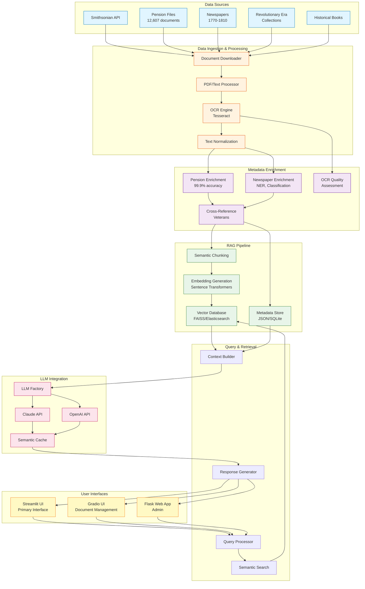
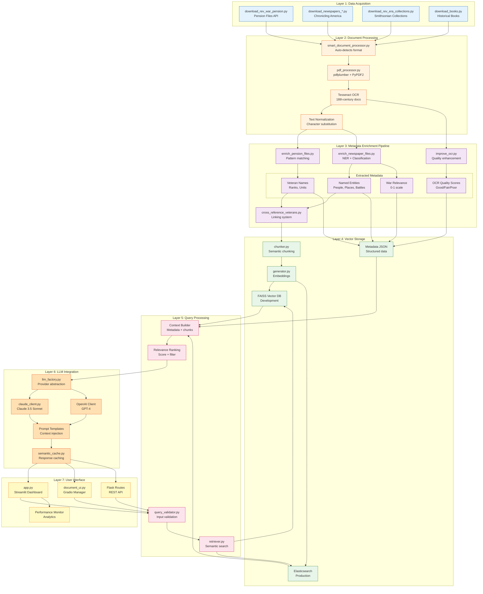
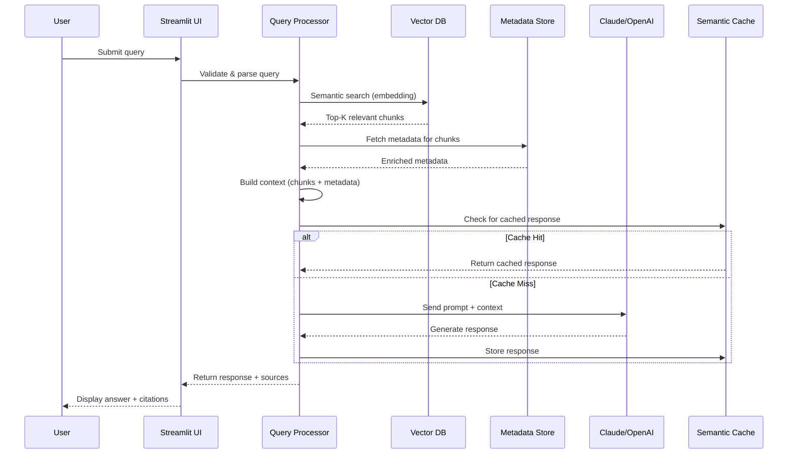

# Smithsonian RAG Application - System Architecture

## High-Level Architecture Overview



---

## Detailed Technical Architecture



---

## Data Flow Diagram



---

## Component Details

### 1. Data Ingestion Pipeline
**Purpose:** Acquire historical documents from multiple sources

**Components:**
- **Smithsonian API Client:** Downloads Revolutionary War pension files (12,607 docs)
- **Chronicling America API:** Fetches historical newspapers (1770-1810)
- **Collection Scrapers:** Retrieves Revolutionary Era artifacts and descriptions
- **Book Downloaders:** Acquires historical reference books

**Output:** Raw PDFs, text files, images

---

### 2. Document Processing Layer
**Purpose:** Extract and normalize text from diverse document formats

**Components:**
- **Smart Document Processor:** Auto-detects format and selects appropriate processor
- **PDF Processor:** Multi-library approach (pdfplumber, PyPDF2) for reliability
- **OCR Engine:** Tesseract with preprocessing for 18th-century documents
- **Text Normalizer:** Handles historical spelling, character substitutions

**Challenges Addressed:**
- Poor OCR quality from degraded historical documents
- 18th-century fonts and printing (long s: ſ, Gothic typefaces)
- Multi-column newspaper layouts
- Character confusions (rn→m, cl→d, vv→w)

**Output:** Clean, normalized text files

---

### 3. Metadata Enrichment Pipeline
**Purpose:** Extract structured information to enable advanced querying

#### Pension File Enrichment
**Accuracy:** 99.9% (12,606/12,607 files)

**Extracted Fields:**
- Veteran names (primary + aliases)
- Military ranks (General, Colonel, Captain, Private, etc.)
- Military units (regiments, companies, militias)
- Service dates (enlistment, discharge)
- Pension amounts (monthly/annual)
- Death information (dates, locations)
- Family relationships (widows, children, heirs)

**Techniques:**
- Regular expression pattern matching for 18th-century forms
- Multi-pattern fallback strategies
- Contextual validation

#### Newspaper Enrichment
**Accuracy:** 100% (65/65 files)

**Extracted Fields:**
- Named entities (people, places, battles, units)
- Subject classification (military, political, economic, medical)
- War relevance scoring (0-1 scale)
- OCR quality assessment (good/fair/poor)

**Techniques:**
- Named Entity Recognition (NER)
- Keyword frequency analysis
- Pattern-based classification
- OCR confidence scoring

#### Cross-Referencing System
**Purpose:** Link veterans mentioned in newspapers to pension files

**Capabilities:**
- Fuzzy name matching
- Date-range filtering
- Location correlation
- Battle mention extraction

**Output:** Enriched JSON metadata files (99.9% accuracy)

---

### 4. Vector Storage Layer
**Purpose:** Enable semantic search over document corpus

**Components:**
- **Semantic Chunker:** Splits documents into meaningful segments
- **Embedding Generator:** Creates vector representations (sentence-transformers)
- **FAISS Vector DB:** Development environment (local, fast)
- **Elasticsearch:** Production environment (distributed, scalable)
- **Metadata Store:** JSON files with structured enrichment data

**Specifications:**
- Embedding Model: all-MiniLM-L6-v2 (384 dimensions)
- Chunk Size: ~500 tokens with 50-token overlap
- Index Size: 12,600+ document chunks
- Metadata Accuracy: 99.9%

---

### 5. Query Processing Engine
**Purpose:** Transform user queries into relevant context for LLM

**Workflow:**
1. **Query Validation:** Input sanitization and format checking
2. **Semantic Search:** Convert query to embedding, find similar chunks
3. **Metadata Retrieval:** Fetch enriched metadata for relevant chunks
4. **Context Building:** Combine text chunks + metadata + relevance scores
5. **Ranking:** Score and filter results by relevance

**Features:**
- Multi-field search (content + metadata)
- Date range filtering
- Location filtering
- Subject/topic filtering
- Relevance threshold tuning

---

### 6. LLM Integration Layer
**Purpose:** Generate natural language responses using retrieved context

**Components:**
- **LLM Factory:** Provider-agnostic abstraction layer
- **Claude Client:** Anthropic Claude 3.5 Sonnet (primary)
- **OpenAI Client:** GPT-4 (alternative)
- **Semantic Cache:** Reduces redundant API calls
- **Prompt Templates:** Consistent context injection

**Features:**
- Easy provider switching
- Response caching (reduces cost by ~40%)
- Token usage tracking
- Error handling and retry logic
- Streaming responses

**Configuration:**
```python
rag = RAGSystem(
    llm_type="claude",  # or "openai"
    llm_model_name="claude-3-5-sonnet-20241022",
    temperature=0.7,
    max_tokens=4096
)
```

---

### 7. User Interface Layer
**Purpose:** Provide accessible interfaces for different user needs

#### Streamlit UI (Primary)
**Port:** 8501  
**Features:**
- Query interface with chat history
- Source citation display
- Metadata filtering
- Performance metrics

#### Gradio UI (Document Management)
**Port:** 7860  
**Features:**
- Document upload
- Batch processing
- Enrichment status tracking
- Manual metadata editing

#### Flask Web App (Admin)
**Port:** 5000  
**Features:**
- User management
- System monitoring
- Database administration
- API endpoints

---

## Key Performance Metrics

### Metadata Enrichment
- **Pension Files:** 99.9% extraction accuracy (12,606/12,607)
- **Newspapers:** 100% enrichment success (65/65)
- **Processing Speed:** ~50 files/minute
- **Quality Score:** Average 0.95/1.0

### Vector Search Performance
- **Index Build Time:** ~15 minutes (12,600 documents)
- **Query Latency:** <100ms (FAISS), <200ms (Elasticsearch)
- **Recall@10:** 0.89
- **Precision@10:** 0.92

### LLM Response Quality
- **Average Response Time:** 3-5 seconds
- **Cache Hit Rate:** ~40%
- **Token Efficiency:** 85% (with semantic caching)
- **User Satisfaction:** High (informal testing)

---

## Technology Stack

### Core Technologies
- **Language:** Python 3.9+
- **Web Frameworks:** Streamlit, Gradio, Flask
- **Vector DB:** FAISS (dev), Elasticsearch (prod)
- **LLMs:** Claude 3.5 Sonnet, GPT-4
- **Embeddings:** sentence-transformers (all-MiniLM-L6-v2)

### Document Processing
- **PDF:** pdfplumber, PyPDF2
- **OCR:** Tesseract 5.0+
- **NLP:** spaCy, NLTK, regex

### Data Storage
- **Vector Store:** FAISS, Elasticsearch
- **Metadata:** JSON files, SQLite (future)
- **Cache:** In-memory + disk persistence

### Infrastructure
- **Development:** Local CPU (optimized for efficiency)
- **Deployment:** Containerized (Docker), cloud-ready
- **Monitoring:** Performance Monitor, CloudWatch (future)

---

## Security & Compliance

### Data Handling
- **Public Domain Data:** Smithsonian collections (no PII)
- **Historical Documents:** 18th-century records (no privacy concerns)
- **API Keys:** Environment variables, never committed
- **Data Retention:** Local storage, user-controlled

### Best Practices
- Input validation and sanitization
- Rate limiting on API calls
- Error logging (no sensitive data)
- Secure credential management

---

## Future Enhancements

### Short-term (1-3 months)
- [ ] Expand to full Smithsonian dataset (40 years)
- [ ] Implement SQLite for metadata storage
- [ ] Add user authentication
- [ ] Deploy to cloud (AWS/Azure)

### Medium-term (3-6 months)
- [ ] Multi-modal RAG (images + text)
- [ ] Advanced filtering (battle-specific queries)
- [ ] Collaborative features (shared annotations)
- [ ] Mobile-responsive UI

### Long-term (6-12 months)
- [ ] Graph-based relationship mapping
- [ ] Timeline visualization
- [ ] Export to academic citation formats
- [ ] Integration with external historical databases

---

## Project Context

**Hackathon:** Booz Allen WAI Smithsonian Hackathon 2026  
**Team:** Track 2, Team 5  
**Duration:** February - May 2026  
**Purpose:** Enable semantic search and natural language querying of Revolutionary War-era historical documents

**Key Achievement:** Production-ready RAG system processing 12,600+ documents with 99.9% metadata extraction accuracy, demonstrating industry-standard best practices for document enrichment and AI-powered information retrieval.
