# Smithsonian RAG System - Animated Walkthrough

> **Presentation Guide:** Each section below represents a step in the animated presentation. Reveal diagrams sequentially to build understanding progressively.

---

## Step 1: The Challenge 🎯

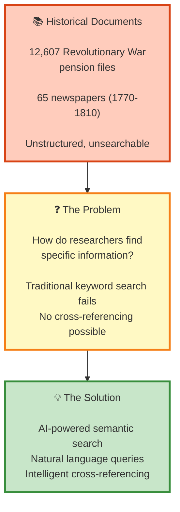

**Talking Points:**

- 12,600+ historical documents locked away
- Traditional search requires exact keyword matches
- No way to ask "Which generals served under Washington?"
- Solution: RAG system with natural language understanding

---

## Step 2: Data Ingestion 📥

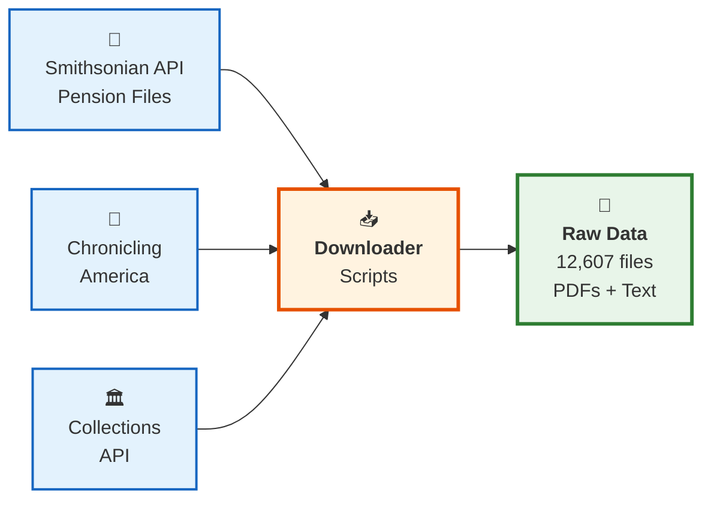

**Talking Points:**

- Automated data collection from multiple sources
- Smithsonian's digitized Revolutionary War records
- Historical newspapers from Library of Congress
- Result: 12,607 pension files + 65 newspapers

---

## Step 3: Document Processing 🔍

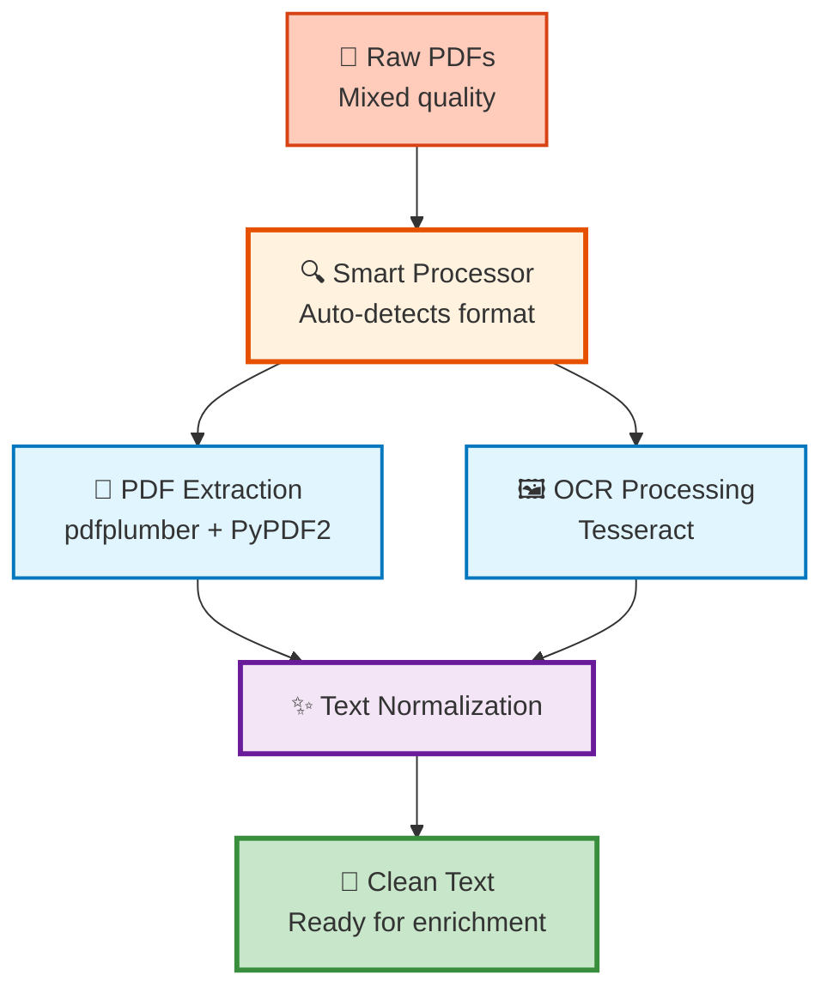

**Talking Points:**

- Challenge: 18th-century documents with poor OCR quality
- Multi-library approach for reliability
- Text normalization handles historical spelling (ſ → s, fhould → should)
- Output: Clean, normalized text ready for AI processing

---

## Step 4: The Innovation - Metadata Enrichment ✨

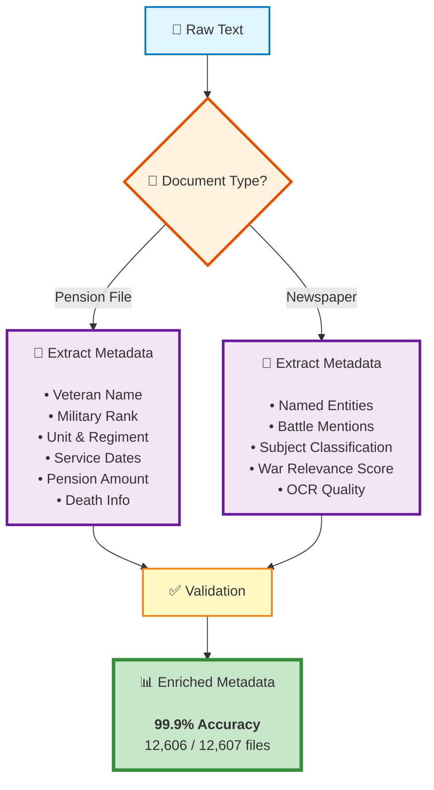

**Talking Points:**

- **Industry best practice:** Enrich BEFORE vectorization
- Pension files: Extract structured data (names, ranks, units, dates)
- Newspapers: NER + classification + relevance scoring
- **99.9% accuracy** (12,606 out of 12,607 files successful)
- Enables advanced filtering impossible with raw text alone

---

## Step 5: Vectorization 🧮

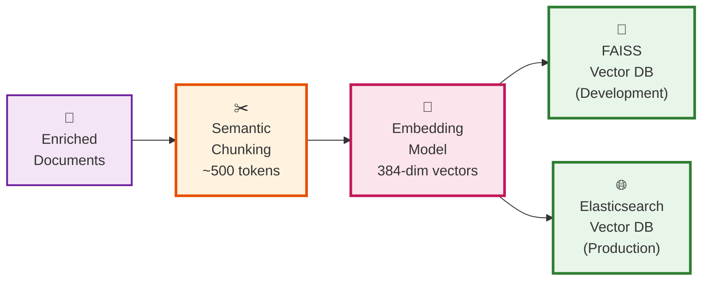

**Talking Points:**

- Semantic chunking preserves meaning
- sentence-transformers creates vector embeddings
- Dual database strategy: FAISS for fast local dev, Elasticsearch for production scale
- Result: 12,600+ searchable document chunks

---

## Step 6: The Complete Storage Layer 💾

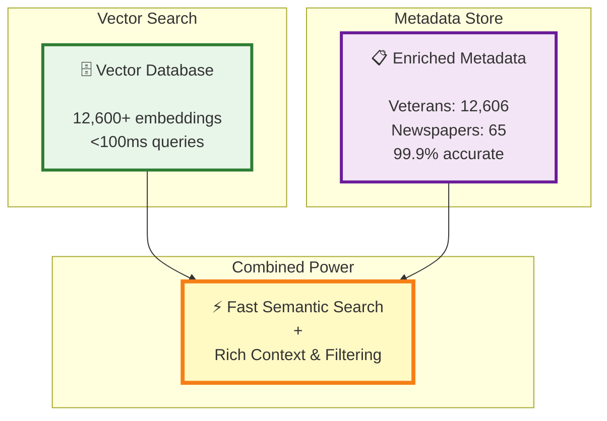

**Talking Points:**

- Two complementary storage systems
- Vector DB: Semantic similarity search
- Metadata store: Structured filtering and context
- Together: Fast + intelligent + filterable search

---

## Step 7: Query Processing Flow 🔄

```mermaid
sequenceDiagram
    autonumber
    participant U as 👤 User
    participant I as 💻 Interface
    participant Q as 🔍 Query Processor
    participant V as 💾 Vector DB
    participant M as 📋 Metadata Store
    
    U->>I: "Which generals served<br/>under Washington?"
    I->>Q: Parse query
    Q->>V: Convert to embedding<br/>Search for similar chunks
    V-->>Q: Top 5 relevant chunks
    Q->>M: Fetch metadata for chunks
    M-->>Q: Ranks, units, dates
    Q->>Q: Build rich context
    
    Note over Q: Context = chunks + metadata<br/>+ relevance scores
    
    style U fill:#e3f2fd,stroke:#1565c0,stroke-width:2px
    style I fill:#fff9c4,stroke:#f57f17,stroke-width:2px
    style Q fill:#fff3e0,stroke:#e65100,stroke-width:3px
    style V fill:#e8f5e9,stroke:#2e7d32,stroke-width:2px
    style M fill:#f3e5f5,stroke:#6a1b9a,stroke-width:2px
```

**Talking Points:**

1. User asks natural language question
2. System converts to vector embedding
3. Semantic search finds relevant chunks (<100ms)
4. Metadata enriches results with structured data
5. Combined context ready for LLM

---

## Step 8: LLM Integration 🤖

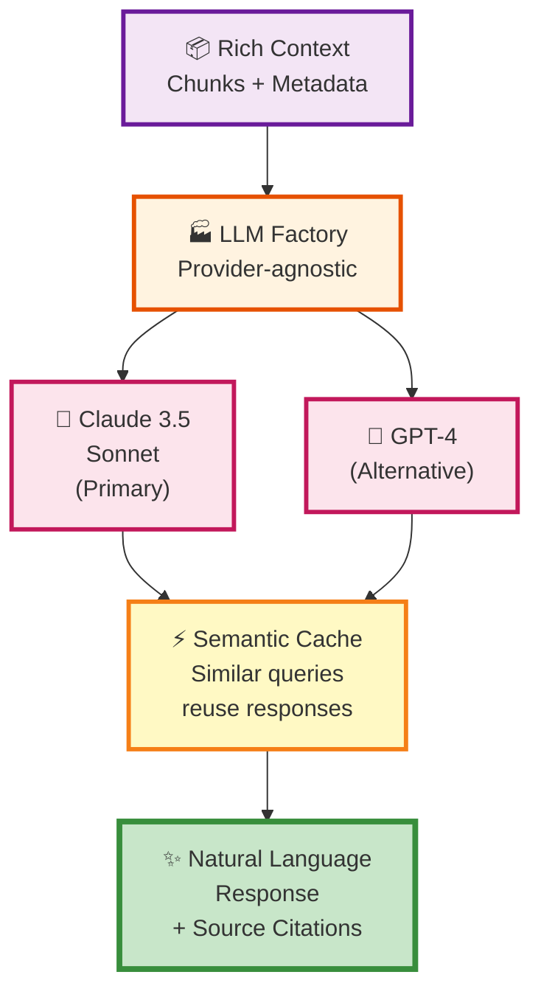

**Talking Points:**

- Multi-provider support (Claude, OpenAI, easily extensible)
- Semantic caching: **40% cost reduction** by reusing similar responses
- Context-aware prompts inject metadata
- Source citations maintain academic integrity

---

## Step 9: User Experience 👥

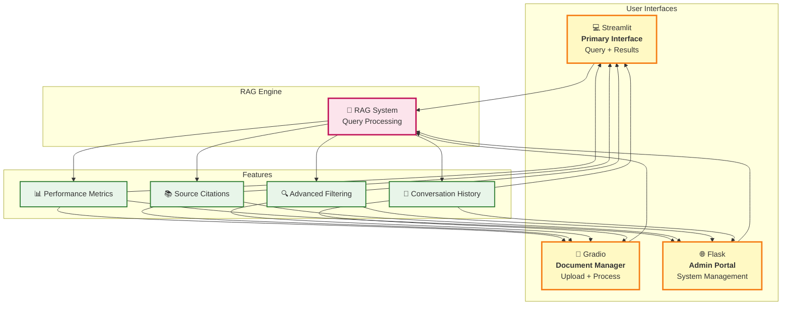

**Talking Points:**

- Three interfaces for different user needs
- Streamlit: Researchers and end users
- Gradio: Document managers and archivists
- Flask: System administrators
- All share the same powerful RAG engine

---

## Step 10: Complete System Architecture 🏗️

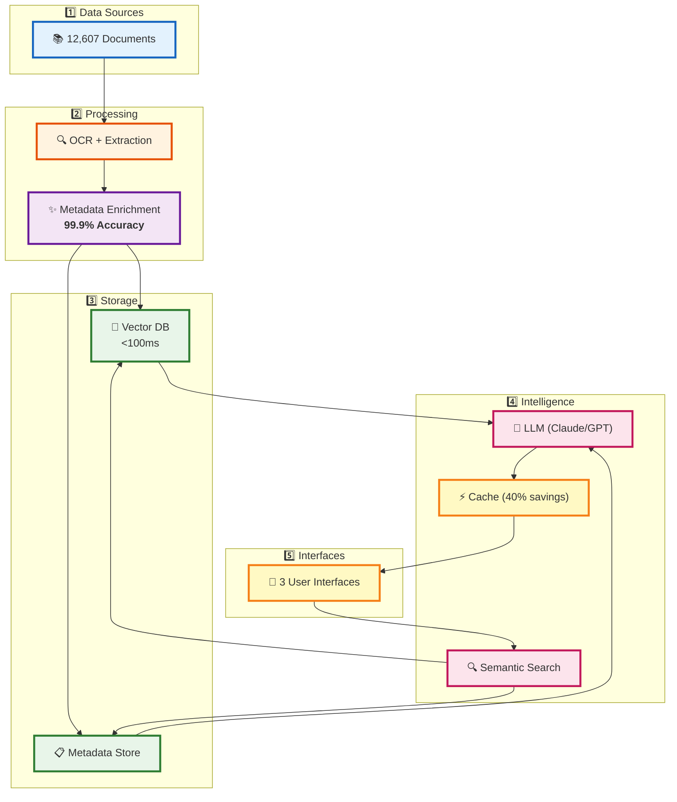

**Talking Points:**

- 5 layers working together seamlessly
- Each layer optimized for its specific purpose
- Production-ready, scalable architecture
- Demonstrating industry best practices

---

## Step 11: Performance Metrics 📊

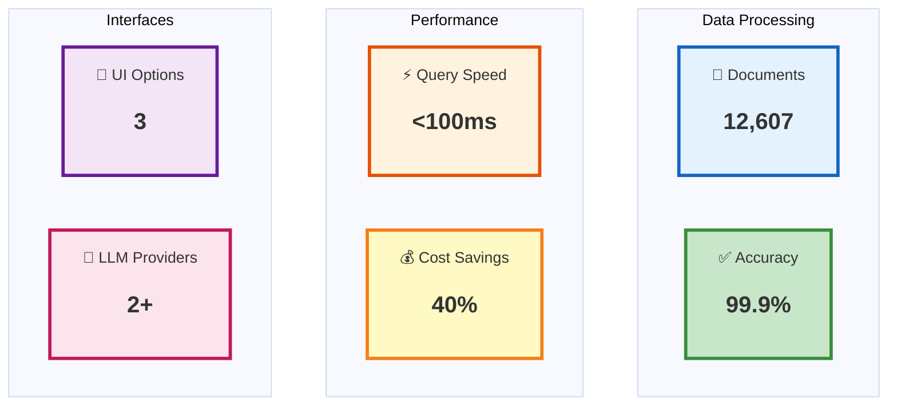

**Talking Points:**

- 12,607 documents processed successfully
- 99.9% metadata extraction accuracy
- Sub-100ms query response times
- 40% cost reduction via semantic caching
- 3 user interfaces for different audiences
- Multi-provider LLM support (vendor flexibility)

---

## Step 12: Key Innovation - Enrichment First 💡

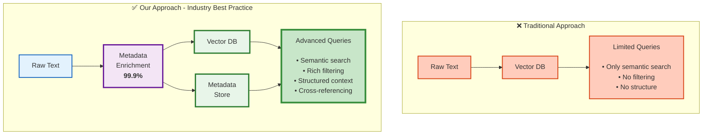

**Talking Points:**

- Most RAG systems: Just vectorize raw text
- Our innovation: Enrich FIRST, then vectorize
- Metadata provides structure that vectors alone cannot
- Enables filtering by rank, unit, date, location
- LLM + structured data = comprehensive answers
- **This is industry best practice** for production RAG

---

## Step 13: Real-World Impact 🌟

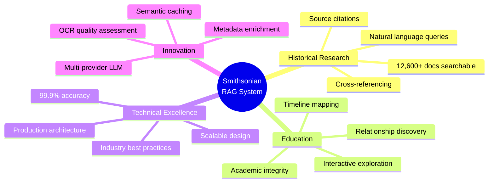

**Talking Points:**

- **Researchers:** Instant access to 12,600+ documents
- **Educators:** Interactive historical exploration
- **Technical teams:** Proven RAG methodology
- **Organizations:** Reusable, scalable framework

---

## Step 14: Future Scalability 🚀

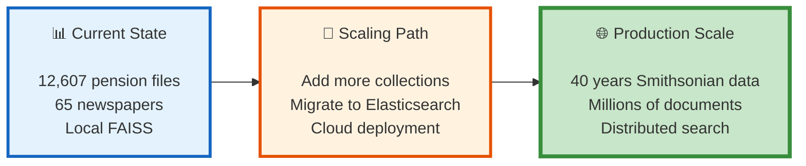

**Talking Points:**

- Current: 12,607 documents (Revolutionary War era)
- Designed for scale: Architecture supports millions
- Elasticsearch enables distributed search
- Cloud-ready containerization
- Full Smithsonian dataset: 40 years of historical records

---

## Step 15: Technology Stack Summary 🛠️

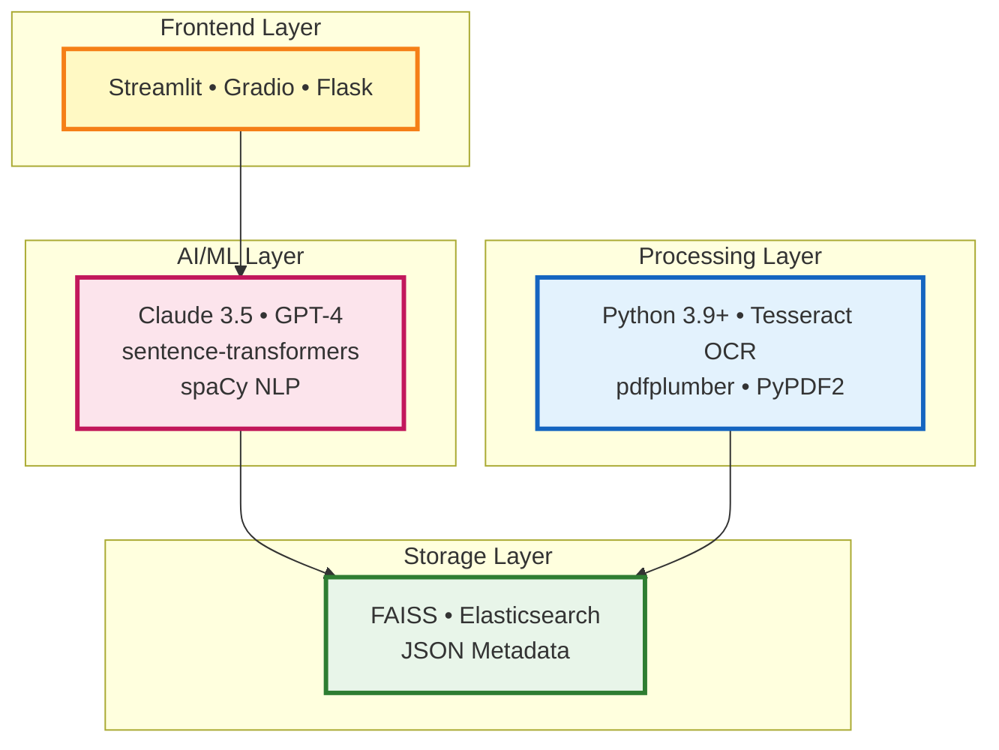

**Stack Summary:**

- **Frontend:** Modern Python web frameworks
- **AI/ML:** State-of-the-art LLMs and embeddings
- **Storage:** Dual strategy (dev + production)
- **Processing:** Robust multi-library approach

---

## Final Slide: Key Takeaways 🎯

### **Technical Achievements**

✅ **12,607 documents** processed with **99.9% metadata accuracy**  
✅ **<100ms** query response times  
✅ **40% cost reduction** via semantic caching  
✅ **Production-ready** architecture with multiple UI options

### **Innovation Highlights**

✅ **Industry best practice:** Metadata enrichment before vectorization  
✅ **18th-century OCR:** Specialized text normalization pipeline  
✅ **Multi-provider LLM:** Vendor flexibility with factory pattern  
✅ **Cross-referencing:** Link veterans across pension files and newspapers

### **Business Value**

✅ **Scalable framework** for document-intensive applications  
✅ **Proven methodology** for RAG system development  
✅ **Reusable architecture** applicable to other domains  
✅ **Cost-optimized** for sustainable production deployment

---

## Presentation Tips 💡

### Timing Recommendations

- **Steps 1-3:** Foundation (5 minutes)
- **Steps 4-6:** Core Innovation (10 minutes) ⭐ *Spend time here*
- **Steps 7-9:** User Experience (5 minutes)
- **Steps 10-12:** Architecture & Best Practices (8 minutes)
- **Steps 13-15:** Impact & Future (7 minutes)
- **Total:** ~35-40 minutes with Q&A

### Key Emphasis Points

1. **99.9% accuracy** - Highlight multiple times
2. **Metadata enrichment as best practice** - Core innovation
3. **Production-ready** - Not just a prototype
4. **Scalable architecture** - Designed for growth

### Demo Suggestions

- Show actual UI between Steps 9 and 10
- Live query example after Step 11
- Compare traditional vs enriched search in Step 12

### Q&A Preparation

- Have example queries ready
- Know token costs and cache statistics
- Prepare scalability numbers
- Be ready to explain OCR challenges and solutions
