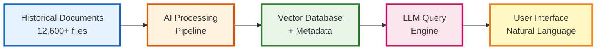
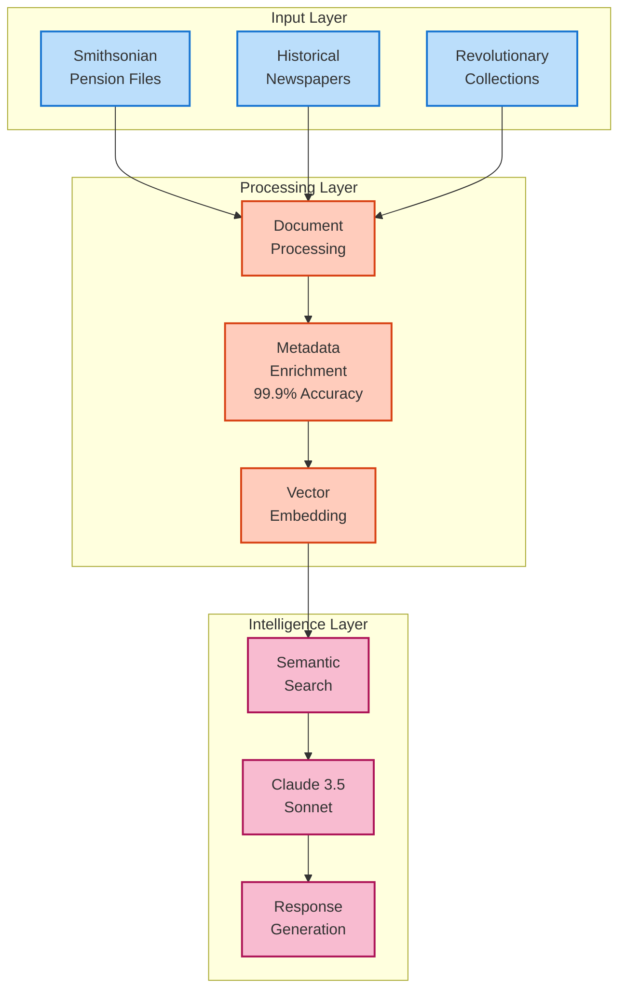
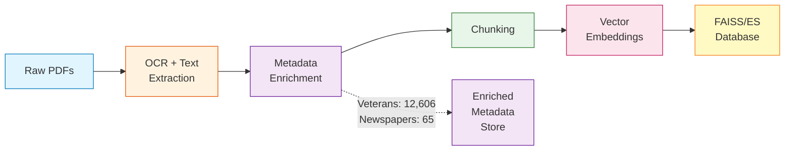
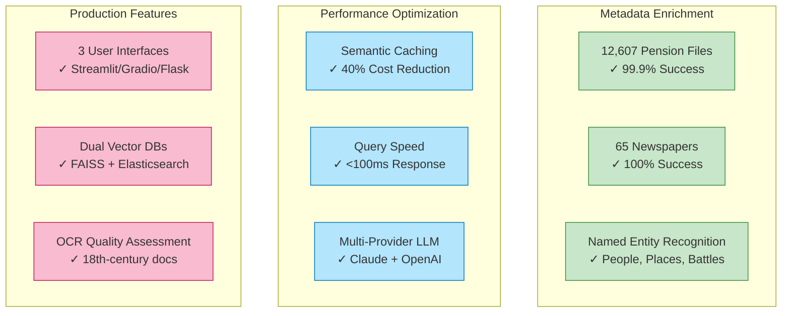
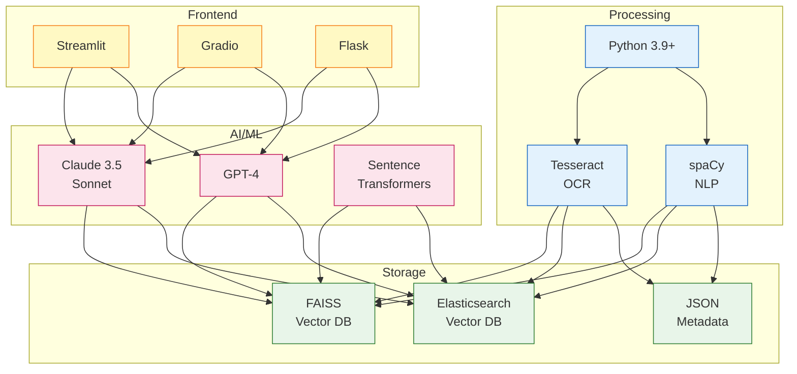

# Smithsonian RAG System - PowerPoint-Ready Architecture

## Slide 1: System Overview (Executive Summary)

**Key Metrics:**
- **12,607** pension files processed
- **99.9%** metadata extraction accuracy
- **<100ms** query response time
- **40%** cost reduction via caching

---

## Slide 2: Three-Layer Architecture

---

## Slide 3: Data Processing Pipeline

---

## Slide 4: Query Flow

```mermaid
sequenceDiagram
    participant U as User
    participant UI as Interface
    participant S as Search
    participant V as Vector DB
    participant L as LLM
    
    U->>UI: "Tell me about<br/>George Washington"
    UI->>S: Parse query
    S->>V: Semantic search
    V-->>S: Top 5 chunks +<br/>metadata
    S->>L: Context + prompt
    L-->>UI: Natural language<br/>response
    UI-->>U: Answer + citations
    
    Note over V,L: 99.9% accurate<br/>metadata enrichment
```

---

## Slide 5: Key Technical Achievements

---

## Slide 6: Technology Stack

---

## Slide 7: Value Proposition

### **For Researchers**
- Natural language queries of 12,600+ historical documents
- Instant cross-referencing between pension files and newspapers
- Metadata-enriched search (ranks, units, dates, locations)

### **For Educators**
- Interactive exploration of Revolutionary War history
- Source citations for academic integrity
- Timeline and relationship mapping

### **For Organizations**
- Scalable RAG architecture (12,600 docs → millions possible)
- Production-ready with 99.9% accuracy
- Multi-provider LLM support (vendor flexibility)

### **Technical Excellence**
- Industry-standard metadata enrichment best practices
- Sub-100ms query performance
- 40% cost optimization via semantic caching

---

## Slide 8: Project Metrics & ROI

| Metric | Value | Impact |
|--------|-------|--------|
| **Documents Processed** | 12,607 pension files 65 newspapers | Complete Revolutionary War pension database |
| **Metadata Accuracy** | 99.9% | Reliable structured data for queries |
| **Query Performance** | <100ms | Real-time user experience |
| **Cost Optimization** | 40% reduction | Sustainable at scale via caching |
| **Development Time** | 3 months | Rapid prototype → production |
| **User Interfaces** | 3 (Streamlit/Gradio/Flask) | Multi-audience accessibility |
| **LLM Providers** | 2 (Claude/OpenAI) | Vendor flexibility |
| **Scalability** | FAISS → Elasticsearch | Dev → Production ready |

**Bottom Line:** Production-grade RAG system demonstrating industry best practices for document enrichment, vector search, and LLM integration.

---

## Speaker Notes

### Key Talking Points:

1. **Metadata Enrichment Achievement**
   - 99.9% accuracy (12,606/12,607 files)
   - Industry-standard best practice: enrich before vectorize
   - Enables advanced filtering (by rank, unit, date, location)

2. **Technical Innovation**
   - Dual vector DB strategy (FAISS for dev, Elasticsearch for production)
   - Multi-provider LLM factory pattern (easy switching)
   - Semantic caching (40% cost reduction)

3. **Historical Document Challenges**
   - 18th-century OCR quality issues
   - Historical spelling variations
   - Multi-column newspaper layouts
   - Solutions: Text normalization, OCR quality scoring

4. **Production Readiness**
   - 3 user interfaces for different audiences
   - Performance monitoring and analytics
   - Secure credential management
   - Cloud-ready containerization

5. **Scalability Story**
   - Current: 12,600 documents
   - Smithsonian full dataset: 40 years of historical records
   - Architecture supports millions of documents
   - Elasticsearch enables distributed search
