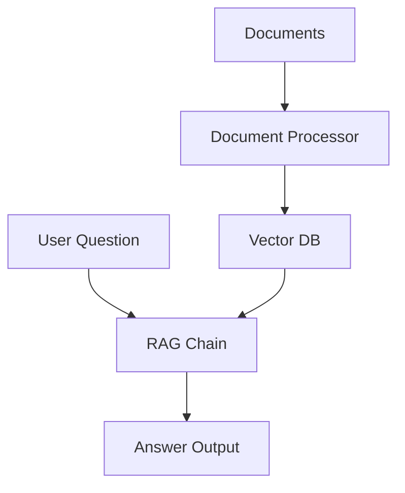
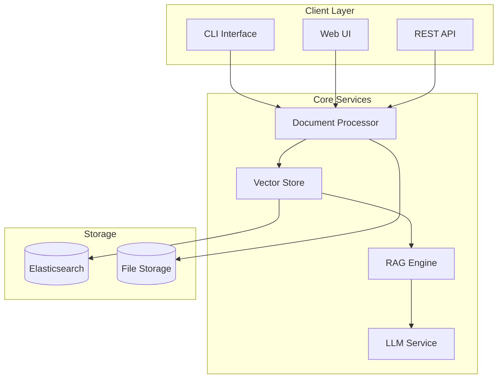
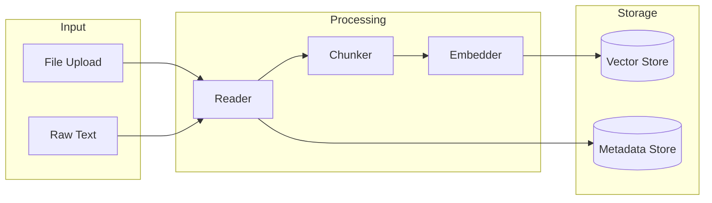
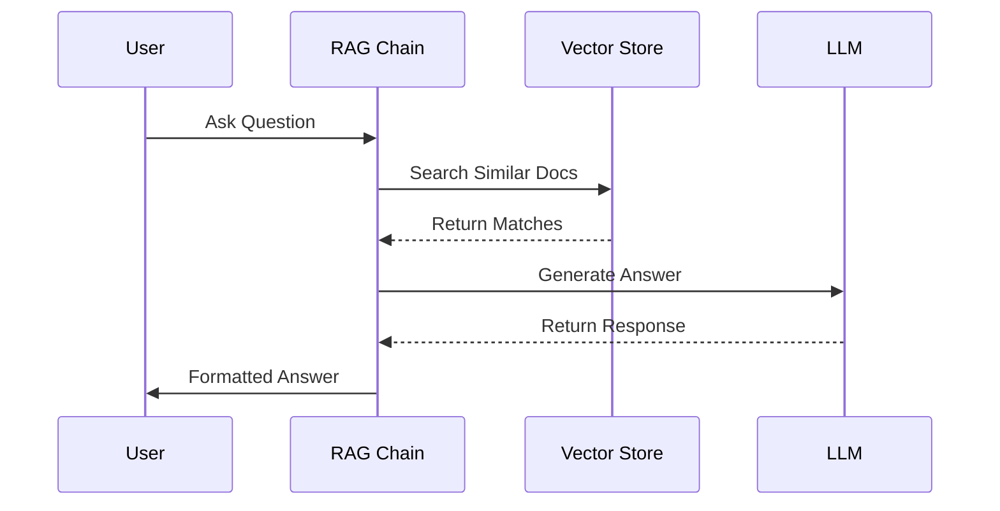
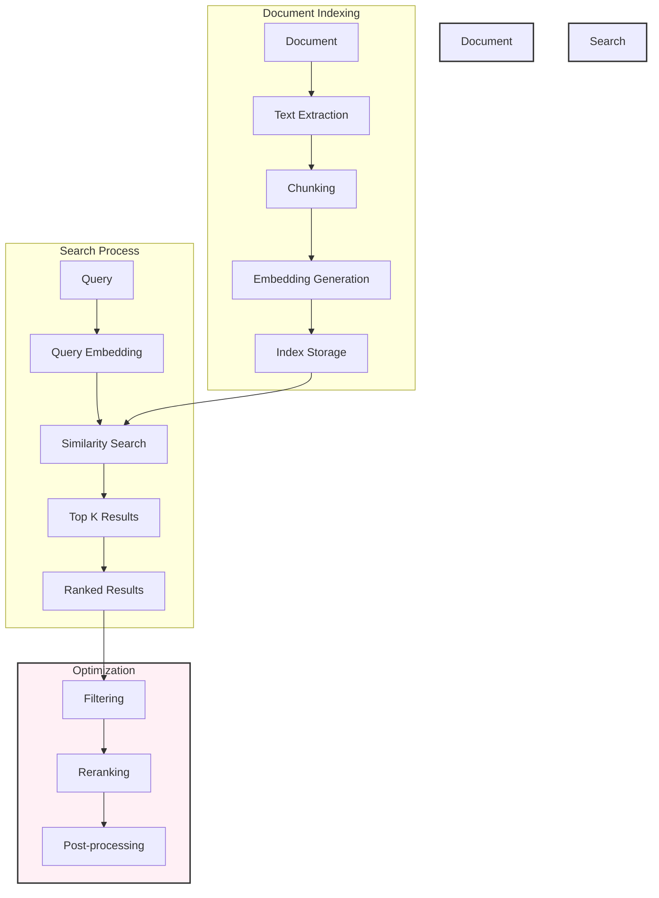

# Technical Design Document: RAG System (MVP)

## Executive Summary

This document outlines the technical design for a Retrieval-Augmented Generation (RAG) system MVP. The system will enable users to query their document collection using natural language, receiving contextually relevant answers. Phase 1 focuses on core functionality through a CLI interface, with potential extension to a web app.

**Key Features:**

- Document processing (PDF, TXT, MD)
- Vector-based semantic search
- LLM-powered answer generation
- Basic CLI interface

**Timeline:** 8 weeks total (4 weeks CLI MVP, 4 weeks Web App)
**Team:** Junior Data Scientist with senior guidance
**Success Metrics:** Document processing accuracy, answer relevance, response time

## Table of Contents

1. [Overview](#1-overview)
   - [Purpose](#purpose)
   - [Goals](#goals)
   - [Success Criteria](#success-criteria)
2. [Resources & References](#2-resources--references)
3. [Code Organization](#3-code-organization)
4. [System Architecture](#4-system-architecture)
5. [Development Guidelines](#5-development-guidelines)
6. [Development Plan](#6-development-plan)

## 1. Overview

### Purpose

This document outlines the technical implementation for Phase 1 (MVP) of the RAG system. This is a proof-of-concept implementation focused on core functionality of first a CLI tool, then a web app if time permits.

For production features, see [`02-technical-design-phase2.md`](02-technical-design-phase2.md).

### Goals

1. Demonstrate core RAG functionality
2. Validate the technical approach
3. Gather feedback for Phase 2

### Success Criteria

- Successfully process PDF, TXT, and MD documents
- Generate relevant answers from documents
- Complete basic operations within reasonable time
- Demonstrate extensibility for Phase 2

## 2. Resources & References

### 2.1 Core Dependencies

#### 2.1.1 Processing Components

- PyPDF2 (PDF processing): <https://pypdf2.readthedocs.io/>
- python-magic (File type detection): <https://github.com/ahupp/python-magic>
- markdown-it-py (Markdown processing): <https://markdown-it-py.readthedocs.io/>

#### 2.1.2 Vector Embeddings

- sentence-transformers: <https://www.sbert.net/>
- HuggingFace Transformers: <https://huggingface.co/docs/transformers/>

#### 2.1.3 Vector Store

- FAISS: [https://github.com/facebookresearch/faiss](https://github.com/facebookresearch/faiss)
- Chroma: [https://www.trychroma.com/](https://www.trychroma.com/)
- Elasticsearch Vector Search:
  - Official Guide: [https://www.elastic.co/guide/en/elasticsearch/reference/current/dense-vector.html](https://www.elastic.co/guide/en/elasticsearch/reference/current/dense-vector.html)
  - Text Embeddings Tutorial: [https://www.elastic.co/docs/explore-analyze/machine-learning/nlp/ml-nlp-text-emb-vector-search-example](https://www.elastic.co/docs/explore-analyze/machine-learning/nlp/ml-nlp-text-emb-vector-search-example)
  - Semantic Search Implementation: [https://www.elastic.co/blog/semantic-search-with-elasticsearch](https://www.elastic.co/blog/semantic-search-with-elasticsearch)
  - RAG with Elasticsearch: [https://www.elastic.co/blog/building-generative-ai-applications-elasticsearch](https://www.elastic.co/blog/building-generative-ai-applications-elasticsearch)

#### 2.1.4 LLM Integration

- LangChain: [https://python.langchain.com/](https://python.langchain.com/)
- OpenAI API: [https://platform.openai.com/docs/api-reference](https://platform.openai.com/docs/api-reference)

### 2.2 Test Documents

#### 2.2.1 Official Documentation

- Python Documentation (PDF): [https://docs.python.org/3/download.html](https://docs.python.org/3/download.html)
- Git Book (PDF, MD): [https://git-scm.com/book/en/v2](https://git-scm.com/book/en/v2)
- Elasticsearch Guide (PDF): [https://www.elastic.co/guide/en/elasticsearch/reference/current/elasticsearch-reference.pdf](https://www.elastic.co/guide/en/elasticsearch/reference/current/elasticsearch-reference.pdf)
- Docker Overview (MD): [https://github.com/docker/docs/tree/main/content](https://github.com/docker/docs/tree/main/content)

#### 2.2.2 Research Papers

- arXiv ML Papers (PDF): [https://arxiv.org/list/cs.LG/recent](https://arxiv.org/list/cs.LG/recent)
- Attention Is All You Need (PDF): [https://arxiv.org/pdf/1706.03762.pdf](https://arxiv.org/pdf/1706.03762.pdf)
- LangChain Papers (PDF): [https://arxiv.org/abs/2310.03722](https://arxiv.org/abs/2310.03722)

#### 2.2.3 Large Text Datasets

- Wikipedia Articles (TXT): [https://dumps.wikimedia.org/](https://dumps.wikimedia.org/)
- Project Gutenberg Books (TXT): [https://www.gutenberg.org/browse/scores/top](https://www.gutenberg.org/browse/scores/top)
- CommonCrawl News (TXT): [https://commoncrawl.org/](https://commoncrawl.org/)

#### 2.2.4 GitHub Documentation

- Awesome-README Collection (MD): [https://github.com/matiassingers/awesome-readme](https://github.com/matiassingers/awesome-readme)
- OpenAI Cookbook (MD): [https://github.com/openai/openai-cookbook](https://github.com/openai/openai-cookbook)
- Google Style Guides (MD): [https://github.com/google/styleguide](https://github.com/google/styleguide)

> Note: When using these documents for testing:
>
> - Ensure compliance with usage terms
> - Keep test datasets small (< 100MB total)
> - Include a mix of document types and content
> - Document any preprocessing steps

### 2.3 RAG Implementation Guides

1. Core Concepts

   - LangChain RAG Tutorial: [https://python.langchain.com/docs/tutorials/rag-app/](https://python.langchain.com/docs/tutorials/rag-app/)
   - Advanced RAG with HuggingFace: [https://huggingface.co/learn/cookbook/advanced_rag](https://huggingface.co/learn/cookbook/advanced_rag)
   - Semantic Search Implementation: [https://www.sbert.net/examples/applications/semantic-search/README.html](https://www.sbert.net/examples/applications/semantic-search/README.html)

1. Vector Store Setup

   - FAISS Getting Started: [https://github.com/facebookresearch/faiss/wiki/Getting-started](https://github.com/facebookresearch/faiss/wiki/Getting-started)
   - Chroma Quickstart: [https://docs.trychroma.com/getting-started](https://docs.trychroma.com/getting-started)
   - Elasticsearch Semantic Search:
     1. Vector Search Setup: [https://www.elastic.co/guide/en/elasticsearch/reference/current/vector-search-setup.html](https://www.elastic.co/guide/en/elasticsearch/reference/current/vector-search-setup.html)
     2. Hybrid Search Tutorial: [https://www.elastic.co/blog/hybrid-search-elasticsearch-vector-text](https://www.elastic.co/blog/hybrid-search-elasticsearch-vector-text)
     3. Performance Tuning: [https://www.elastic.co/blog/how-to-tune-elastic-vector-search-for-accuracy-speed-and-cost](https://www.elastic.co/blog/how-to-tune-elastic-vector-search-for-accuracy-speed-and-cost)

1. LLM Integration

   - LangChain Agents: [https://python.langchain.com/docs/modules/agents/](https://python.langchain.com/docs/modules/agents/)
   - RAG Best Practices: [https://www.pinecone.io/learn/rag-patterns/](https://www.pinecone.io/learn/rag-patterns/)

1. Prompt Engineering

   - Kaggle Guide: [https://www.kaggle.com/whitepaper-prompt-engineering](https://www.kaggle.com/whitepaper-prompt-engineering)
   - OpenAI Best Practices: [https://platform.openai.com/docs/guides/prompt-engineering](https://platform.openai.com/docs/guides/prompt-engineering)
   - Anthropic Prompt Design: [https://docs.anthropic.com/claude/docs/prompt-engineering](https://docs.anthropic.com/claude/docs/prompt-engineering)
   - LangChain Prompting Guide: [https://python.langchain.com/docs/modules/model_io/prompts/prompt_templates](https://python.langchain.com/docs/modules/model_io/prompts/prompt_templates)
   - Microsoft Learn: [https://learn.microsoft.com/en-us/semantic-kernel/prompt-engineering/](https://learn.microsoft.com/en-us/semantic-kernel/prompt-engineering/)
   - Brex's Prompt Engineering Guide: [https://github.com/brexhq/prompt-engineering](https://github.com/brexhq/prompt-engineering)

### 2.4 CLI Development

1. Framework Options

   - Click Tutorial: [https://click.palletsprojects.com/en/8.1.x/quickstart/](https://click.palletsprojects.com/en/8.1.x/quickstart/)
   - Typer (Click-based): [https://typer.tiangolo.com/](https://typer.tiangolo.com/)
   - Fire (Google): [https://github.com/google/python-fire](https://github.com/google/python-fire)

1. Example Projects

   - Click Examples: [https://github.com/pallets/click/tree/main/examples](https://github.com/pallets/click/tree/main/examples)
   - Typer CLI App: [https://typer.tiangolo.com/tutorial/first-steps/](https://typer.tiangolo.com/tutorial/first-steps/)
   - LangChain CLI: [https://github.com/langchain-ai/langchain/tree/master/libs/cli](https://github.com/langchain-ai/langchain/tree/master/libs/cli)

### 2.5 Web App Development (if time permits)

1. Streamlit

   - Official Tutorial: [https://docs.streamlit.io/get-started/tutorials](https://docs.streamlit.io/get-started/tutorials)
   - Best Practices: [https://docs.streamlit.io/library/advanced-features/best-practices](https://docs.streamlit.io/library/advanced-features/best-practices)
   - Component Gallery: [https://streamlit.io/components](https://streamlit.io/components)

2. Gradio

   - Getting Started: [https://www.gradio.app/guides/quickstart](https://www.gradio.app/guides/quickstart)
   - Examples Gallery: [https://www.gradio.app/demos](https://www.gradio.app/demos)
   - HuggingFace Integration: [https://huggingface.co/docs/hub/gradio-spaces](https://huggingface.co/docs/hub/gradio-spaces)

### 2.6 Sample Code Repositories

1. End-to-End RAG Examples

   - LangChain RAG Template: [https://github.com/langchain-ai/langchain/tree/master/templates/rag-conversation](https://github.com/langchain-ai/langchain/tree/master/templates/rag-conversation)
   - HuggingFace RAG Pipeline: [https://huggingface.co/spaces/Xenova/rag-pipeline](https://huggingface.co/spaces/Xenova/rag-pipeline)

2. CLI Examples

   - Click Examples: [https://github.com/pallets/click/tree/main/examples](https://github.com/pallets/click/tree/main/examples)
   - Typer CLI Examples: [https://github.com/tiangolo/typer/tree/master/examples](https://github.com/tiangolo/typer/tree/master/examples)

3. Streamlit Examples

   - Official Gallery: [https://streamlit.io/gallery](https://streamlit.io/gallery)
   - Example Apps: [https://github.com/streamlit/demo-self-driving](https://github.com/streamlit/demo-self-driving)

## 3. Code Organization

This section provides a high-level overview of the code organization. For detailed implementation specifications, see:

- [Technical Design - Implementation Details](02-technical-design-phase1-impl.md)
- [Technical Design - API Reference](02-technical-design-phase1-api.md)

### 3.1 Technical Design Document Code

The TDD contains essential interfaces and critical implementation details:

### 3.2 Core Interfaces

#### 3.2.1 Interface Overview

```python
class DocumentReader:
    def read_file(self, file_path: Path) -> Dict[str, Any]: pass

class ElasticsearchStore:
    def add_documents(self, documents: List[Dict]): pass
    def similarity_search(self, query: str, k: int = 5) -> List[Dict]: pass
    
    # Phase 2: Document Lifecycle Management
    # def delete_documents(self, doc_ids: List[str]): pass
    # def update_document(self, doc_id: str, document: Dict): pass
    # def bulk_delete(self, query: Dict): pass
    # def bulk_update(self, documents: List[Dict]): pass

class RAGChain:
    def generate_answer(self, question: str) -> Dict: pass
    def chat(self, message: str, history: List[Dict] = None) -> Dict: pass
```

#### 3.2.2 Detailed API Reference

#### 3.2.3 DocumentReader

```python
def read_file(self, file_path: Path) -> Dict[str, Any]:
    """Read and process a document file.
    
    Args:
        file_path: Path to the document (PDF, TXT, or MD)
        
    Returns:
        Dict containing:
        - content: Extracted text content
        - metadata: File metadata (type, size, etc.)
    """
```

#### 3.2.4 ElasticsearchStore

```python
def add_documents(self, documents: List[Dict]):
    """Add document chunks to Elasticsearch with vector embeddings.
    
    Args:
        documents: List of documents with content and metadata
    """

def similarity_search(self, query: str, k: int = 5) -> List[Dict]:
    """Perform semantic search using vector embeddings.
    
    Args:
        query: Search query
        k: Number of results to return
        
    Returns:
        List of matching documents with scores
    """
```

#### 3.2.5 RAGChain

```python
def generate_answer(self, question: str) -> str:
    """Generate answer using RAG pipeline (Phase 1).
    
    Args:
        question: User's question
        
    Returns:
        str: Generated response without sources
    """

def generate_answer_with_sources(self, question: str) -> Dict:
    """Generate answer using RAG pipeline with source tracking (Phase 2).
    
    Args:
        question: User's question
        
    Returns:
        Dict containing:
        - answer: Generated response
        - sources: Supporting document snippets
        - metadata: Response metadata
    """

def chat(self, message: str) -> str:
    """Simple chat without context management (Phase 1).
    
    Args:
        message: User's message
        
    Returns:
        str: Generated response
    """

def chat_with_history(self, message: str, history: List[Dict] = None) -> Dict:
    """Interactive chat with context management (Phase 2).
    
    Args:
        message: User's message
        history: Previous conversation turns
        
    Returns:
        Dict containing response and context
    """
```

#### 3.3 Critical Configurations

#### 3.3.1 Vector Search Settings

```python
ELASTICSEARCH_CONFIG = {
    "index": {
        "mappings": {
            "properties": {
                "content": {"type": "text"},
                "embedding": {
                    "type": "dense_vector",
                    "dims": 768,
                    "index": True,
                    "similarity": "cosine"
                }
            }
        }
    }
}
```

#### 3.3.2 RAG Prompt Template

```python
BASE_PROMPT = """
Answer the question based on the provided context.

Context:
{context}

Question: {question}

Answer in a helpful and informative way. If the context doesn't contain
enough information to answer the question fully, acknowledge this and
provide the best possible answer with the available information.

Answer:"""
```

#### 3.4 Implementation Examples

Detailed implementation examples are provided in the following notebooks:

1. **Document Processing** (`notebooks/01_document_processing.ipynb`):
   - File type handling (PDF, TXT, MD)
   - Text extraction and cleaning
   - Chunking strategies
   - Error handling

2. **Vector Store** (`notebooks/02_vector_store.ipynb`):
   - Elasticsearch setup
   - Document indexing
   - Vector search examples
   - Performance optimization

3. **RAG Implementation** (`notebooks/03_rag_chain.ipynb`):
   - End-to-end pipeline
   - Chat examples
   - Prompt engineering
   - LLM integration

#### 3.4.1 Semantic Search

*Location: `notebooks/04_semantic_search.ipynb`*

- Text embeddings generation
- Similarity metrics comparison
- Search optimization techniques
- Performance benchmarking

Refer to these notebooks for complete implementation details and working examples.

## 4. System Architecture

### 4.1 High-Level Design



### 4.2 Core Components

1. **Document Processor**
   - Reads documents (PDF, TXT)
   - Splits into chunks
   - Handles basic errors

2. **Vector Store**

   - Elasticsearch backend
   - Stores document chunks
   - Enables semantic search

3. **RAG Chain**
   - Retrieves relevant context
   - Generates answers
   - Tracks sources

### 4.3 MVP Scope

#### 4.3.1 Must Have

- Basic document processing (PDF, TXT)
- Vector search capability using Elasticsearch
- Command Line Interface (CLI)
  - Document upload and processing
  - Basic Q&A mode (answers only)
  - Basic search commands
- Local deployment

#### 4.3.2 Nice to Have

- Markdown (MD) file support
- Source tracking in answers
  - Reference documents
  - Relevant snippets
  - Confidence scores
- Interactive chat mode
  - Chat history
  - Context preservation
- Streamlit Web Application
  - Document upload interface
  - Chat-like Q&A interface
  - Search results visualization
- Basic error handling
- Simple logging
- Input validation

#### 4.3.3 Out of Scope

> All production features are documented in [02-technical-design-phase2.md](02-technical-design-phase2.md)

- Authentication/authorization
- Multi-user support
- High availability
- Security features
- Advanced monitoring

- Backup/recovery

### 4.4 Phased Development Approach

> Note: This approach breaks down the MVP into smaller, manageable pieces that build upon each other.
> Each phase should be completed, tested, and reviewed before moving to the next.

#### 4.4.1 Phase 1: Basic Document Processing (3-4 days)

1. **TXT File Processing** (1-2 days) - [Issue #1](https://github.com/justinlawyer/rag-app/issues/1), [Issue #2](https://github.com/justinlawyer/rag-app/issues/2)
   - [ ] Implement basic file reading
   - [ ] Simple text extraction
   - [ ] Fixed-size text chunking

   - [ ] Basic validation (file exists, not empty)
   - [ ] Unit tests for happy path

2. **PDF Support** (2 days) - [Issue #3](https://github.com/justinlawyer/rag-app/issues/3)
   - [ ] Add PDF text extraction using PyMuPDF
   - [ ] Handle basic PDF errors (file not found, corrupt file)

#### 4.4.2 Optional Coverage Features

1. **Web Application** - [Issue #4](https://github.com/justinlawyer/rag-app/issues/4), [Issue #5](https://github.com/justinlawyer/rag-app/issues/5)
   - Basic FastAPI setup
   - File upload endpoint
   - Basic error handling

2. **Semantic Search** - [Issue #6](https://github.com/justinlawyer/rag-app/issues/6), [Issue #7](https://github.com/justinlawyer/rag-app/issues/7)
   - Vector store integration
   - Text embedding generation
   - Basic similarity search

3. **Document Viewer** - [Issue #8](https://github.com/justinlawyer/rag-app/issues/8)
   - Web-based document viewer
   - Chunk navigation
   - Search functionality

#### 4.4.3 Out of Scope Features

1. **Performance Optimization** - [Issue #9](https://github.com/justinlawyer/rag-app/issues/9)
   - Advanced monitoring
   - Performance optimization
   - Load testing
   - Distributed processing

2. **Security Implementation** - [Issue #10](https://github.com/justinlawyer/rag-app/issues/10)
   - Authentication
   - Authorization
   - Advanced security features
   - Penetration testing
   - Add document references
   - Include relevant snippets
   - Add confidence scores

3. **Interactive Mode**
   - Chat history management
   - Context preservation
   - Enhanced CLI interface

4. **Enhanced Search**
   - Multi-document queries
   - Ranking improvements
   - Search filters

5. **Web Interface**
   - Basic Streamlit app
   - Document upload interface
   - Chat-like Q&A interface
   - Search results visualization
   - Basic error handling
   - Simple logging
   - Input validation

> Note: Each task should be:
>
> - Small enough to complete in 1-2 days
> - Have clear acceptance criteria
> - Be independently testable
> - Build towards the next phase

## 5. Development Guidelines

### 5.1 Code Standards

- All classes and methods must have docstrings following Google Python Style Guide
- Type hints required for all function parameters and return values
- Follow PEP 8 style guide
- Use descriptive variable names
- Maximum line length of 88 characters (Black formatter)
- Use f-strings for string formatting

## 6. Development Plan

For a detailed task breakdown with checkboxes and dependencies, see [02-technical-design-phase1-tasks.md](02-technical-design-phase1-tasks.md).

### 6.1 Timeline Overview (Junior Data Scientist)

#### Phase 1: CLI MVP (Weeks 1-4)

1. **Week 1: Setup & Document Processing**
   - Development environment setup
   - Basic PDF and TXT file reading
   - Simple text extraction
   - Basic error handling

2. **Week 2: Chunking & Storage**
   - Text chunking implementation
   - Vector embeddings setup
   - Basic Elasticsearch integration
   - Initial unit tests

3. **Week 3: Search & Retrieval**
   - Vector search implementation
   - Basic semantic search
   - Result ranking
   - Integration tests

4. **Week 4: CLI & Core RAG**
   - CLI interface implementation
   - Basic Q&A functionality
   - Error handling
   - Documentation

#### Phase 2: Web App & Enhancements (Weeks 5-8)

1. **Week 5: Web Foundation**
   - Streamlit setup
   - Basic page layout
   - Document upload UI
   - Simple Q&A interface

2. **Week 6: Enhanced Features**
   - Markdown support
   - Source tracking
   - Confidence scores
   - Error messaging

3. **Week 7: Chat Interface**
   - Chat mode implementation
   - Context preservation
   - History tracking
   - UI polish

4. **Week 8: Testing & Refinement**
   - End-to-end testing
   - Performance optimization
   - Documentation updates
   - Bug fixes

- Documentation (2-3 days)
  - Code documentation
  - Usage examples
  - Setup guide

### 6.2 Time Allocation Notes

1. **Learning Curve (40% of time)**
   - New technologies (Elasticsearch, LangChain)
   - Vector embeddings concepts
   - Testing frameworks
   - Best practices

2. **Development (40% of time)**
   - Core implementation
   - Debugging
   - Basic error handling

3. **Testing & Documentation (20% of time)**
   - Essential test coverage
   - Basic documentation

> Note: Timeline assumes:
>
> - Full-time dedication
> - Regular access to senior guidance
> - No major infrastructure issues
> - Focus on MVP features only

ELASTICSEARCH_URL=[http://localhost:9200](http://localhost:9200)
CHUNK_SIZE=1000
CHUNK_OVERLAP=200

## 7. Implementation Details

### 7.1 Document Processor

```python
from pathlib import Path
from typing import Dict, Any

class DocumentReader:
    def read_file(self, file_path: Path) -> Dict[str, Any]:
        """Read and extract text from a document."""
        # Implementation details in src/document_processing/reader.py
```

### 7.2 Vector Store

```python
class ElasticsearchStore:
    def add_documents(self, documents: List[Dict]):
        """Add document chunks to Elasticsearch."""
        # Implementation details in src/vector_store/elasticsearch_store.py
```

### 7.3 RAG Chain

```python
class RAGChain:
    def generate_answer(self, question: str) -> Dict:
        """Generate answer using RAG approach."""
        # Implementation details in src/rag_core/chain.py
```

## 8. Testing Strategy

### 8.1 Component Tests

- Document processing tests
- Vector store operations
- RAG chain functionality

### 8.2 Integration Tests

- End-to-end document processing
- Search functionality
- Answer generation

### Performance Tests

- Document processing time
- Vector store query latency
- Memory usage
- Error rates
- Success/failure counts

## Appendices

### A. API Reference

- Document Processing API
- Vector Store API
- RAG Chain API

### B. Configuration Guide

- Environment variables
- Elasticsearch settings
- Model parameters

### C. Troubleshooting Guide

- Common issues
- Debug procedures
- Error messages

## Additional Documentation

### Code Examples

For detailed implementation examples, see [code-examples.md](code-examples.md):

- Document Processing implementation
- Vector Store implementation
- RAG Chain implementation
- CLI and Web UI examples
- Docker configuration

### API Documentation

For API details and usage, see [api-reference.md](api-reference.md):

- Document Processing API
- Vector Store API
- RAG Chain API
- CLI and Web interfaces

### Configuration Guide

For installation and configuration, see [setup-guide.md](setup-guide.md):

- Local development setup
- Docker deployment
- Configuration options
- Development tools
- Troubleshooting

## System Architecture

### High-Level Overview



### Data Processing Flow



### Query Flow



### Semantic Search Flow



### Implementation Tips

1. **Common Issues**

   ```python
   # Issue: Chunks too large
   # Fix: Adjust chunk size
   chunker = TextChunker(
       chunk_size=500,  # Decrease from default 1000
       overlap=50      # Adjust overlap accordingly
   )

   # Issue: Slow search
   # Fix: Add index
   vector_store = ElasticsearchStore(
       index_settings={
           "index.mapping.nested_fields.limit": 100,
           "index.number_of_shards": 1
       }
   )

   # Issue: Out of memory
   # Fix: Batch processing
   for chunk_batch in chunker.create_chunks_batched(text, batch_size=10):
       vector_store.add_documents(chunk_batch)
   ```

2. **Debugging Tools**

   ```python
   # 1. Enable debug logging
   import logging
   logging.basicConfig(level=logging.DEBUG)

   # 2. Print embeddings shape
   from sentence_transformers import SentenceTransformer
   model = SentenceTransformer('all-MiniLM-L6-v2')
   embeddings = model.encode("test")
   print(f"Shape: {embeddings.shape}")

   # 3. Check Elasticsearch
   curl -X GET "localhost:9200/_cat/indices?v"
   ```

3. **Testing Strategy**

   ```python
   # 1. Start with small files
   def test_basic_functionality():
       text = "This is a test document."
       chunks = chunker.create_chunks(text)
       assert len(chunks) > 0

   # 2. Test edge cases
   def test_edge_cases():
       # Empty text
       assert len(chunker.create_chunks("")) == 0
       # Single character
       assert len(chunker.create_chunks("a")) == 1

   # 3. Test integration
   ```python
   def test_full_pipeline():
       doc = reader.read_file("test.txt")
       chunks = chunker.create_chunks(doc["text"])
       vector_store.add_documents(chunks)
       results = vector_store.similarity_search("test")
       assert len(results) > 0
   ```

## Development Logging

```python
# Enable debug logging
import logging
logging.basicConfig(
    level=logging.DEBUG,
    format='%(asctime)s - %(name)s - %(levelname)s - %(message)s'
)
```

### Basic Event Logging

```python
logger = logging.getLogger(__name__)
logger.info("Processing document: %s", doc_id)
logger.error("Failed to process: %s", error)
```

### Performance Metrics

- Document processing time
- Vector store query latency
- Memory usage
- Error rates
- Success/failure counts

### Project Schedule

- **Document processing** (3-4 days)
  - Learning document processing libraries
  - Implementing PDF/TXT/MD readers
  - Text chunking and validation
  - Basic error handling

- **Vector store setup** (3-4 days)
  - Understanding vector embeddings
  - Elasticsearch vector search setup
  - Basic CRUD operations

```python
def generate_answer(self, question: str) -> Dict:
    """Generate answer using RAG approach."""
    # Implementation details in src/rag_core/chain.py
```

### REST API Design

- **REST** strategy

### Test Plan

- **Document processing tests**
- **Vector store operations**
- **RAG chain functionality**
- **CLI and Web interfaces**

### Installation Instructions

For installation and configuration, see [`setup-guide.md`](setup-guide.md)

### Development Environment

#### Local Development Setup

#### Docker Deployment

#### Configuration Options

#### Development Tools

#### Troubleshooting

## Technical Architecture Details

{{ ... }}

```python
    with fitz.open(file_path) as doc:
        # Extract context-enhancing metadata
        metadata = {
            "hierarchy": self.extract_document_hierarchy(doc),
            "text_types": self.extract_text_types(doc),
            "page_boundaries": self.get_page_boundaries(doc)
        }
```python
                text = "\n".join(
                    page.extract_text() 
                    for page in doc
                )

{{ ... }}

| `TextChunker.create_chunks()` | 2.1, 2.2 | Basic chunking and strategies |
| `TextChunker.**chunk_by_pages**()` | 2.3 | Page-aware chunking |
| `TextChunker.**find_natural_boundary**()` | 2.4 | Smart boundary detection |
| `TextChunker.**get_chunk_metadata**()` | 2.5 | Chunk metadata extraction |

### Debug Configuration

{{ ... }}

```python
# Enable debug logging
import logging
```

### System Metrics

- Document processing time
- Vector store query latency
- Memory usage
- Error rates
- Success/failure counts

### Performance Optimization

- Document processing time
- Vector store query latency
- Memory usage
- Error rates
- Success/failure counts
