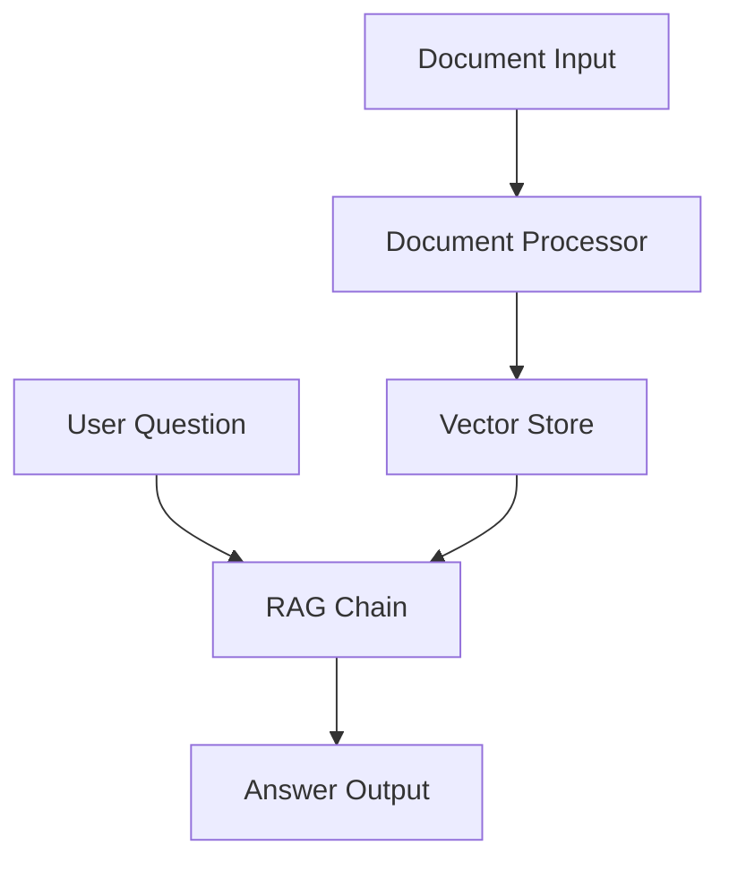

# RAG System
# Technical Design Document: RAG System (MVP)

## 1. Overview

### Purpose
This document outlines the technical implementation for Phase 1 (MVP) of the RAG system. This is a proof-of-concept implementation focused on core functionality. For production features, see [`02-technical-design-phase2.md`](02-technical-design-phase2.md).

### Goals
1. Demonstrate core RAG functionality
2. Validate the technical approach
3. Gather feedback for Phase 2

### Success Criteria
- Successfully process PDF and TXT documents
- Generate relevant answers from documents
- Complete basic operations within reasonable time
- Demonstrate extensibility for Phase 2

## 2. System Architecture

### High-Level Design


### Core Components
1. **Document Processor**
   - Reads documents (PDF, TXT)
   - Splits into chunks
   - Handles basic errors

2. **Vector Store**
   - Elasticsearch backend
   - Stores document chunks
   - Enables semantic search

3. **RAG Chain**
   - Retrieves relevant context
   - Generates answers
   - Tracks sources

### MVP Scope

#### Must Have
- Basic document processing
- Vector search capability
- Simple Q&A interface
- Local deployment

#### Nice to Have
- Basic error handling
- Simple logging
- Input validation

#### Out of Scope
> All production features are documented in [`02-technical-design-phase2.md`](02-technical-design-phase2.md)
- Authentication/authorization
- Multi-user support
- High availability
- Security features
- Advanced monitoring
- Backup/recovery

## 3. Development Guidelines

### Code Standards
- All classes and methods must have docstrings following Google Python Style Guide
- Type hints required for all function parameters and return values
- Maximum line length of 88 characters (Black formatter)
- Use f-strings for string formatting

## 4. Development Plan

### Timeline Overview
- Week 1: Core Components (Setup, Document Processing, Vector Store)
- Week 2: Integration (RAG Chain, CLI, Web UI)
- Week 3: Testing & Documentation

### Task Breakdown

#### Phase 1: Core Components (5 days)
1. **Setup (1 day)**
   - Development environment
   - Dependencies
   - Elasticsearch

2. **Document Processing (2 days)**
   - PDF/TXT reader
   - Text chunking
   - Unit tests

3. **Vector Store (2 days)**
   - Index setup
   - Vector operations
   - Integration tests

#### Phase 2: Integration (4 days)
4. **RAG Chain (2 days)**
   - LLM integration
   - Context retrieval
   - Answer generation

5. **Command Line Interface (1 day)**
   - Basic commands
   - Error handling
   - Documentation

6. **Web Interface (1 day)**
   - Streamlit app
   - Basic UI
   - Error handling

#### Phase 3: Finalization (1 day)
7. **Documentation & Testing**
   - Code comments
   - Usage examples
   - Final tests

## 4. Development Guide

### Project Structure
```
rag/
├── src/
│   ├── document_processing/
│   │   ├── reader.py      # Document reading
│   │   └── chunker.py     # Text chunking
│   ├── vector_store/
│   │   └── elasticsearch_store.py
│   └── rag/
│       └── chain.py       # RAG implementation
├── tests/
│   ├── test_document_processing.py
│   ├── test_vector_store.py
│   └── test_rag.py
├── cli/
│   └── rag_cli.py
└── web/
    └── app.py
```

### Setup Instructions
```bash
# 1. Clone repository
git clone <repository-url>
cd rag

# 2. Create virtual environment
python -m venv venv
source venv/bin/activate

# 3. Install dependencies
pip install -r requirements.txt

# 4. Start Elasticsearch
docker run -d -p 9200:9200 elasticsearch:8.9.0

# 5. Run tests
python -m pytest
```

## 5. Implementation Details

### Document Processing
```python
from pathlib import Path
from typing import Dict, Any

class DocumentReader:
    def read_file(self, file_path: Path) -> Dict[str, Any]:
        """Read and extract text from a document."""
        # Implementation details in src/document_processing/reader.py
```

### Vector Store
```python
class ElasticsearchStore:
    def add_documents(self, documents: List[Dict]):
        """Add document chunks to Elasticsearch."""
        # Implementation details in src/vector_store/elasticsearch_store.py
```

### RAG Chain
```python
class RAGChain:
    def generate_answer(self, question: str) -> Dict:
        """Generate answer using RAG approach."""
        # Implementation details in src/rag/chain.py
```

## 6. Testing Strategy

### Unit Tests
- Document processing tests
- Vector store operations
- RAG chain functionality

### Integration Tests
- End-to-end document processing
- Search functionality
- Answer generation

### Performance Tests
- Document processing time
- Search latency
- Memory usage

## 7. Appendices

### A. API Reference
- Document Processing API
- Vector Store API
- RAG Chain API

### B. Configuration Guide
- Environment variables
- Elasticsearch settings
- Model parameters

### C. Troubleshooting Guide
- Common issues
- Debug procedures
- Error messages

## Additional Documentation

### Code Examples
For detailed implementation examples, see [`code-examples.md`](code-examples.md):
- Document Processing implementation
- Vector Store implementation
- RAG Chain implementation
- CLI and Web UI examples
- Docker configuration

### API Reference
For API details and usage, see [`api-reference.md`](api-reference.md):
- Document Processing API
- Vector Store API
- RAG Chain API
- CLI and Web interfaces

### Setup Guide
For installation and configuration, see [`setup-guide.md`](setup-guide.md):
- Local development setup
- Docker deployment
- Configuration options
- Development tools
- Troubleshooting

## Quick Start for Junior Developers

### Key Concepts
1. **RAG (Retrieval Augmented Generation)**
   - Combines search and AI to answer questions
   - Uses document content as context
   - Provides source-backed answers

2. **Vector Embeddings**
   - Convert text to numbers (vectors)
   - Enable semantic search
   - Similar meanings have similar vectors

3. **Document Processing Pipeline**


### Development Tips
1. **Common Issues**
   ```python
   # Issue: Chunks too large
   # Fix: Adjust chunk size
   chunker = TextChunker(
       chunk_size=500,  # Decrease from default 1000
       overlap=50      # Adjust overlap accordingly
   )

   # Issue: Slow search
   # Fix: Add index
   vector_store = ElasticsearchStore(
       index_settings={
           "index.mapping.nested_fields.limit": 100,
           "index.number_of_shards": 1
       }
   )

   # Issue: Out of memory
   # Fix: Batch processing
   for chunk_batch in chunker.create_chunks_batched(text, batch_size=10):
       vector_store.add_documents(chunk_batch)
   ```

2. **Debugging Tools**
   ```python
   # 1. Enable debug logging
   import logging
   logging.basicConfig(level=logging.DEBUG)

   # 2. Print embeddings shape
   from sentence_transformers import SentenceTransformer
   model = SentenceTransformer('all-MiniLM-L6-v2')
   embeddings = model.encode("test")
   print(f"Shape: {embeddings.shape}")

   # 3. Check Elasticsearch
   curl -X GET "localhost:9200/_cat/indices?v"
   ```

3. **Testing Strategy**
   ```python
   # 1. Start with small files
   def test_basic_functionality():
       text = "This is a test document."
       chunks = chunker.create_chunks(text)
       assert len(chunks) > 0

   # 2. Test edge cases
   def test_edge_cases():
       # Empty text
       assert len(chunker.create_chunks("")) == 0
       # Single character
       assert len(chunker.create_chunks("a")) == 1

   # 3. Test integration
   def test_full_pipeline():
       doc = reader.read_file("test.txt")
       chunks = chunker.create_chunks(doc["text"])
       vector_store.add_documents(chunks)
       results = vector_store.similarity_search("test")
       assert len(results) > 0
   ```

# RAG System Technical Design Document (TDD)

## Getting Started Guide

### 1. Development Environment Setup
```bash
# 1. Create a virtual environment
python -m venv venv

# 2. Activate the environment
# On macOS/Linux:
source venv/bin/activate
# On Windows:
# .\venv\Scripts\activate

# 3. Install basic dependencies
pip install -r requirements.txt

# 4. Install development dependencies
pip install pytest pytest-cov black flake8

# 5. Set up pre-commit hooks
pre-commit install
```

### 2. Project Structure
```
rag/
├── src/
│   ├── document_processing/
│   │   ├── __init__.py
│   │   ├── reader.py      # Document reading
│   │   └── chunker.py     # Text chunking
│   ├── vector_store/
│   │   ├── __init__.py
│   │   └── elasticsearch_store.py
│   └── rag/
│       ├── __init__.py
│       └── chain.py       # RAG implementation
├── tests/
│   ├── __init__.py
│   ├── test_document_processing.py
│   ├── test_vector_store.py
│   └── test_rag.py
├── notebooks/            # Example notebooks
│   ├── 01_document_processing.ipynb
│   ├── 02_vector_store.ipynb
│   └── 03_rag_chain.ipynb
└── config/
    └── elasticsearch.yml
```

### 3. Configuration Files

#### requirements.txt
```
# Core dependencies
pypdf2>=3.0.0
langchain>=0.0.300
sentence-transformers>=2.2.0
elasticsearch>=8.9.0
streamlit>=1.24.0

# Development
pytest>=7.4.0
pytest-cov>=4.1.0
black>=23.7.0
flake8>=6.0.0
pre-commit>=3.3.3
jupyter>=1.0.0
```

#### .pre-commit-config.yaml
```yaml
repos:
-   repo: https://github.com/psf/black
    rev: 23.7.0
    hooks:
    -   id: black
        language_version: python3.11
-   repo: https://github.com/pycqa/flake8
    rev: 6.0.0
    hooks:
    -   id: flake8
```

### 4. Development Workflow

1. **Start with Document Processing**
   ```bash
   # Create feature branch
   git checkout -b feature/document-processing
   
   # Implement reader and chunker
   touch src/document_processing/{reader,chunker}.py
   
   # Run tests
   pytest tests/test_document_processing.py -v
   
   # Format code
   black src/document_processing/
   ```

2. **Set up Elasticsearch**
   ```bash
   # Start Elasticsearch (Docker)
   docker run -d -p 9200:9200 -e "discovery.type=single-node" elasticsearch:8.9.0
   
   # Test connection
   curl http://localhost:9200
   ```

3. **Implement Vector Store**
   ```bash
   # Create feature branch
   git checkout -b feature/vector-store
   
   # Implement vector store
   touch src/vector_store/elasticsearch_store.py
   
   # Run tests
   pytest tests/test_vector_store.py -v
   ```

### 5. Common Tasks

```bash
# Run all tests
pytest

# Run tests with coverage
pytest --cov=src

# Format all code
black src/ tests/

# Lint code
flake8 src/ tests/

# Create documentation
pdoc src/ -o docs/
```

## System Architecture

### High-Level Design
```
[Documents] → [Document Processor] → [Vector DB] → [RAG Chain] → [UI]
     ↓              ↓                    ↓            ↓          ↓
[File System]  [Text Chunks]      [Elasticsearch]   [LLM]   [Streamlit]
```

### Component Architecture
1. **Document Processor**
   - File system monitoring
   - Text extraction
   - Chunking
   - Vector generation

2. **Vector Storage**
   - Elasticsearch indices
   - Vector similarity search
   - Document metadata
   - Search optimization

3. **RAG Chain**
   - Context retrieval
   - LLM integration
   - Answer generation
   - Source tracking

4. **Web Interface**
   - Streamlit frontend
   - Real-time updates
   - File management
   - Chat interface

## Technical Stack

### Backend
- Python 3.11+
- FastAPI for API
- Elasticsearch for vectors
- LangChain for RAG
- PyPDF2 for PDFs
- sentence-transformers

### Frontend
- Streamlit
- streamlit-extras

### Testing
- pytest
- pytest-asyncio
- pytest-cov

### Dependencies
```
# Web Framework
fastapi>=0.100.0
uvicorn[standard]>=0.22.0

# Vector Storage
elasticsearch>=8.9.0

# RAG Pipeline
langchain>=0.0.300
sentence-transformers>=2.2.0

# Document Processing
pypdf2>=3.0.0
watchdog>=3.0.0
python-multipart>=0.0.6

# Frontend
streamlit>=1.24.0
streamlit-extras>=0.3.0

# Testing
pytest>=7.4.0
pytest-asyncio>=0.21.0
pytest-cov>=4.1.0
black>=23.7.0
flake8>=6.0.0
```

## Step-by-Step Implementation Guide

### Step 1: Document Reader Implementation
```python
# src/document_processing/reader.py

from pathlib import Path
from typing import Dict, Any
import PyPDF2

class DocumentReader:
    def __init__(self):
        # List of supported file extensions
        self.supported_formats = {
            '.pdf': self._read_pdf,
            '.txt': self._read_txt
        }
    
    def read_file(self, file_path: str | Path) -> Dict[str, Any]:
        """Read a file and extract its text content and metadata."""
        path = Path(file_path)
        
        # Check if file exists
        if not path.exists():
            raise FileNotFoundError(f"File not found: {path}")
        
        # Check if format is supported
        if path.suffix.lower() not in self.supported_formats:
            raise ValueError(
                f"Unsupported format: {path.suffix}. "
                f"Supported formats: {list(self.supported_formats.keys())}"
            )
        
        # Read file using appropriate method
        return self.supported_formats[path.suffix.lower()](path)
    
    def _read_pdf(self, path: Path) -> Dict[str, Any]:
        """Read a PDF file using PyPDF2."""
        try:
            with path.open('rb') as file:
                reader = PyPDF2.PdfReader(file)
                text = '\n'.join(
                    page.extract_text() 
                    for page in reader.pages
                )
                metadata = {
                    'source': str(path),
                    'type': 'pdf',
                    'pages': len(reader.pages),
                    'title': path.stem,
                    **(reader.metadata if reader.metadata else {})
                }
                return {'text': text, 'metadata': metadata}
        except PyPDF2.PdfReadError as e:
            raise ValueError(f"Error reading PDF: {e}")
    
    def _read_txt(self, path: Path) -> Dict[str, Any]:
        """Read a text file with encoding handling."""
        try:
            text = path.read_text(encoding='utf-8')
        except UnicodeDecodeError:
            text = path.read_text()
        
        metadata = {
            'source': str(path),
            'type': 'txt',
            'size': path.stat().st_size,
            'title': path.stem
        }
        return {'text': text, 'metadata': metadata}
```

### Step 2: Text Chunker Implementation
```python
# src/document_processing/chunker.py

from typing import List, Dict, Any
import re
from dataclasses import dataclass

@dataclass
class ChunkConfig:
    chunk_size: int = 1000  # Target size of each chunk
    overlap: int = 200      # Overlap between chunks
    min_size: int = 50      # Minimum chunk size

class TextChunker:
    def __init__(self, chunk_size: int = 1000, overlap: int = 200):
        self.config = ChunkConfig(
            chunk_size=chunk_size,
            overlap=overlap
        )
    
    def create_chunks(
        self, text: str, metadata: Dict[str, Any] = None
    ) -> List[Dict[str, Any]]:
        """Split text into overlapping chunks."""
        if not text.strip():
            return []
            
        # Split into sentences first
        sentences = self._split_into_sentences(text)
        
        chunks = []
        current_chunk = []
        current_size = 0
        
        for i, sentence in enumerate(sentences):
            sentence_size = len(sentence)
            
            if current_size + sentence_size <= self.config.chunk_size:
                current_chunk.append(sentence)
                current_size += sentence_size
            else:
                # Save current chunk if not empty
                if current_chunk:
                    chunks.append(self._create_chunk_dict(
                        ' '.join(current_chunk),
                        len(chunks),
                        metadata
                    ))
                
                # Start new chunk with overlap
                overlap_start = max(0, len(current_chunk) - 2)
                current_chunk = current_chunk[overlap_start:] + [sentence]
                current_size = sum(len(s) for s in current_chunk)
        
        # Add final chunk
        if current_chunk:
            chunks.append(self._create_chunk_dict(
                ' '.join(current_chunk),
                len(chunks),
                metadata
            ))
        
        return chunks
    
    def _split_into_sentences(self, text: str) -> List[str]:
        """Split text into sentences using regex."""
        # Handle common abbreviations
        abbrev = r'(?:[A-Za-z]\.){2,}|[A-Z][a-z]{1,2}\.'
        
        # Split on sentence boundaries
        pattern = f"(?<=[.!?])\s+(?<!{abbrev})(?=[A-Z0-9])"
        sentences = [s.strip() for s in re.split(pattern, text)]
        return [s for s in sentences if s]
    
    def _create_chunk_dict(
        self,
        text: str,
        chunk_id: int,
        metadata: Dict[str, Any] = None
    ) -> Dict[str, Any]:
        """Create a chunk dictionary with metadata."""
        return {
            'text': text,
            'metadata': {
                'chunk_id': chunk_id,
                'length': len(text),
                **(metadata or {})
            }
        }
```

### Step 3: Vector Store Implementation
```python
# src/vector_store/elasticsearch_store.py

from typing import List, Dict, Any
from elasticsearch import Elasticsearch
from sentence_transformers import SentenceTransformer
import numpy as np

class ElasticsearchStore:
    """Vector store using Elasticsearch.
    
    Key Features:
    - Stores text and embeddings
    - Performs similarity search
    - Handles metadata
    - Efficient batch operations
    
    Example:
        store = ElasticsearchStore()
        
        # Add documents
        docs = [{
            'text': 'Example document',
            'metadata': {'source': 'test.pdf'}
        }]
        store.add_documents(docs)
        
        # Search
        results = store.similarity_search(
            'example query',
            k=5  # Return top 5 results
        )
    """
    
    def __init__(
        self,
        es_host: str = 'http://localhost:9200',
        index_name: str = 'documents',
        model_name: str = 'all-MiniLM-L6-v2'
    ):
        # Initialize Elasticsearch client
        self.es = Elasticsearch(es_host)
        self.index_name = index_name
        
        # Load embedding model
        self.model = SentenceTransformer(model_name)
        
        # Create index if it doesn't exist
        if not self.es.indices.exists(index=index_name):
            self._create_index()
    
    def _create_index(self):
        """Create Elasticsearch index with vector search."""
        settings = {
            'mappings': {
                'properties': {
                    'text': {'type': 'text'},
                    'embedding': {
                        'type': 'dense_vector',
                        'dims': self.model.get_sentence_embedding_dimension(),
                        'index': True,
                        'similarity': 'cosine'
                    },
                    'metadata': {
                        'type': 'object',
                        'enabled': True
                    }
                }
            },
            'settings': {
                'index': {
                    'number_of_shards': 1,
                    'refresh_interval': '1s'
                }
            }
        }
        
        self.es.indices.create(
            index=self.index_name,
            body=settings
        )
    
    def add_documents(
        self,
        documents: List[Dict[str, Any]],
        batch_size: int = 100
    ) -> None:
        """Add documents to the vector store.
        
        Args:
            documents: List of dicts with 'text' and optional 'metadata'
            batch_size: Number of documents per batch
            
        Example document format:
        {
            'text': 'Document content here',
            'metadata': {
                'source': 'file.pdf',
                'page': 1,
                'chunk_id': 0
            }
        }
        """
        # Process in batches to avoid memory issues
        for i in range(0, len(documents), batch_size):
            batch = documents[i:i + batch_size]
            
            # Create embeddings for batch
            texts = [doc['text'] for doc in batch]
            embeddings = self.model.encode(texts)
            
            # Prepare bulk indexing operation
            operations = []
            for doc, embedding in zip(batch, embeddings):
                operations.extend([
                    {
                        'index': {
                            '_index': self.index_name
                        }
                    },
                    {
                        'text': doc['text'],
                        'embedding': embedding.tolist(),
                        'metadata': doc.get('metadata', {})
                    }
                ])
            
            # Execute bulk operation
            if operations:
                self.es.bulk(operations)
    
    def similarity_search(
        self,
        query: str,
        k: int = 5,
        min_score: float = 0.0
    ) -> List[Dict[str, Any]]:
        """Search for similar documents.
        
        Args:
            query: Search query
            k: Number of results to return
            min_score: Minimum similarity score (0-1)
            
        Returns:
            List of dicts with:
                - text: Document content
                - metadata: Document metadata
                - score: Similarity score
        """
        # Generate query embedding
        query_embedding = self.model.encode(query)
        
        # Prepare search query
        search_query = {
            'size': k,
            'query': {
                'script_score': {
                    'query': {'match_all': {}},
                    'script': {
                        'source': "cosineSimilarity(params.query_vector, 'embedding') + 1.0",
                        'params': {
                            'query_vector': query_embedding.tolist()
                        }
                    }
                }
            },
            '_source': ['text', 'metadata']
        }
        
        # Execute search
        response = self.es.search(
            index=self.index_name,
            body=search_query
        )
        
        # Process results
        results = []
        for hit in response['hits']['hits']:
            score = (hit['_score'] - 1.0) / 2.0  # Convert to 0-1 range
            if score >= min_score:
                results.append({
                    'text': hit['_source']['text'],
                    'metadata': hit['_source']['metadata'],
                    'score': score
                })
        
        return results
```

### Step 4: RAG Chain Implementation
```python
# src/rag/chain.py

from typing import Dict, Any, List
from langchain.chat_models import ChatOpenAI
from langchain.prompts import ChatPromptTemplate
from langchain.schema import AIMessage, HumanMessage
from src.vector_store.elasticsearch_store import ElasticsearchStore

class RAGChain:
    """RAG (Retrieval Augmented Generation) Chain.
    
    This class combines:
    1. Document retrieval from vector store
    2. Context formatting
    3. LLM response generation
    4. Source tracking
    
    Example:
        store = ElasticsearchStore()
        chain = RAGChain(store)
        
        response = chain.generate_answer(
            "What is machine learning?"
        )
        print(response['answer'])
        for source in response['sources']:
            print(f"Source: {source['text']}")
    """
    
    def __init__(
        self,
        vector_store: ElasticsearchStore,
        model_name: str = "gpt-3.5-turbo",
        temperature: float = 0.0,
        max_tokens: int = 500
    ):
        self.vector_store = vector_store
        
        # Initialize LLM
        self.llm = ChatOpenAI(
            model_name=model_name,
            temperature=temperature,
            max_tokens=max_tokens
        )
        
        # Create prompt template
        self.prompt = ChatPromptTemplate.from_messages([
            ("system", """You are a helpful AI assistant. 
            Answer questions based on the provided context.
            If you don't know or can't find the answer in the context, 
            say 'I don't have enough information to answer that question.'
            Always be accurate and truthful."""),
            ("human", """Question: {question}
            
Context:
{context}
            
Answer the question based on the context above.""")
        ])
    
    def generate_answer(
        self,
        question: str,
        num_sources: int = 3,
        min_score: float = 0.5
    ) -> Dict[str, Any]:
        """Generate an answer using RAG.
        
        Args:
            question: User's question
            num_sources: Number of sources to retrieve
            min_score: Minimum similarity score for sources
            
        Returns:
            Dict with:
                - answer: Generated answer
                - sources: List of source documents
        """
        # 1. Retrieve relevant documents
        sources = self.vector_store.similarity_search(
            query=question,
            k=num_sources,
            min_score=min_score
        )
        
        # If no relevant sources found
        if not sources:
            return {
                "answer": "I don't have enough information to answer that question.",
                "sources": []
            }
        
        # 2. Format context from sources
        context = "\n\n".join(
            f"Source {i+1}:\n{source['text']}"
            for i, source in enumerate(sources)
        )
        
        # 3. Generate answer using LLM
        messages = self.prompt.format_messages(
            question=question,
            context=context
        )
        
        response = self.llm.invoke(messages)
        
        return {
            "answer": response.content,
            "sources": sources
        }
    
    def chat(
        self,
        messages: List[Dict[str, str]],
        num_sources: int = 3
    ) -> Dict[str, Any]:
        """Chat with context from documents.
        
        Args:
            messages: List of message dicts with 'role' and 'content'
            num_sources: Number of sources to retrieve
            
        Returns:
            Dict with:
                - answer: Assistant's response
                - sources: List of source documents
        """
        # Convert messages to LangChain format
        chat_messages = []
        for msg in messages:
            if msg["role"] == "user":
                chat_messages.append(HumanMessage(
                    content=msg["content"]
                ))
            elif msg["role"] == "assistant":
                chat_messages.append(AIMessage(
                    content=msg["content"]
                ))
        
        # Get last user message
        last_question = messages[-1]["content"]
        
        # Generate response with sources
        return self.generate_answer(
            question=last_question,
            num_sources=num_sources
        )
```

### Example Usage

#### Document Processing
```python
# notebooks/01_document_processing.ipynb

# %% [markdown]
# # Document Processing Example
# This notebook demonstrates how to use the document processing components.

# %% [markdown]
# ## 1. Setup
# First, let's import our components and set up some test files.

# %%
from pathlib import Path
from src.document_processing.reader import DocumentReader
from src.document_processing.chunker import TextChunker

# Create test files
test_dir = Path("test_files")
test_dir.mkdir(exist_ok=True)

# Create a test PDF (using reportlab for demo)
from reportlab.pdfgen import canvas
def create_test_pdf(path: Path, text: str):
    c = canvas.Canvas(str(path))
    c.drawString(100, 750, text)
    c.save()

# Create test files
test_pdf = test_dir / "test.pdf"
create_test_pdf(test_pdf, "This is a test PDF document.")

test_txt = test_dir / "test.txt"
test_txt.write_text("This is a test text document.\nIt has multiple lines.")

# %% [markdown]
# ## 2. Reading Documents
# Now let's try reading different types of documents.

# %%
# Initialize reader
reader = DocumentReader()

# Read PDF
pdf_result = reader.read_file(test_pdf)
print("PDF Content:", pdf_result["text"])
print("PDF Metadata:", pdf_result["metadata"])

# Read TXT
txt_result = reader.read_file(test_txt)
print("\nTXT Content:", txt_result["text"])
print("TXT Metadata:", txt_result["metadata"])

# %% [markdown]
# ## 3. Chunking Text
# Let's see how the chunker works with different settings.

# %%
# Initialize chunker with different settings
default_chunker = TextChunker()
small_chunker = TextChunker(chunk_size=20, overlap=5)

# Test text
test_text = """This is a longer piece of text that will be split into chunks.
It contains multiple sentences. Each sentence should ideally stay together.
The chunker should try to break at natural boundaries."""

# Compare chunking results
default_chunks = default_chunker.create_chunks(test_text)
small_chunks = small_chunker.create_chunks(test_text)

print("Default Chunks:")
for chunk in default_chunks:
    print(f"\nChunk {chunk['metadata']['chunk_index']}:")
    print(f"Text: {chunk['text'][:50]}...")
    print(f"Length: {len(chunk['text'])}")

print("\nSmall Chunks:")
for chunk in small_chunks:
    print(f"\nChunk {chunk['metadata']['chunk_index']}:")
    print(f"Text: {chunk['text']}")
    print(f"Length: {len(chunk['text'])}")

# %% [markdown]
# ## 4. Error Handling
# Let's see how the system handles errors.

# %%
# Try reading non-existent file
try:
    reader.read_file(test_dir / "nonexistent.pdf")
except FileNotFoundError as e:
    print(f"Expected error: {e}")

# Try reading unsupported format
try:
    reader.read_file(test_dir / "test.docx")
except ValueError as e:
    print(f"Expected error: {e}")

# %% [markdown]
# ## 5. Cleanup

# %%
# Remove test files
import shutil
shutil.rmtree(test_dir)
```

## Deployment Guide

### 1. Local Development Setup
```bash
# 1. Clone repository
git clone <repository-url>
cd rag-system

# 2. Create virtual environment
python -m venv venv
source venv/bin/activate  # On Windows: .\venv\Scripts\activate

# 3. Install dependencies
pip install -r requirements.txt

# 4. Set up pre-commit hooks
pre-commit install

# 5. Start Elasticsearch (using Docker)
docker run -d \
    -p 9200:9200 \
    -e "discovery.type=single-node" \
    -e "xpack.security.enabled=false" \
    elasticsearch:8.9.0

# 6. Run tests
pytest

# 7. Start Streamlit app
streamlit run src/app.py
```

### 2. Environment Variables
```bash
# .env
# OpenAI API Key
OPENAI_API_KEY=your-api-key

# Elasticsearch settings
ELASTICSEARCH_HOST=http://localhost:9200
ELASTICSEARCH_INDEX=rag-documents

# Streamlit settings
STREAMLIT_SERVER_PORT=8501
STREAMLIT_SERVER_ADDRESS=0.0.0.0
```

### 3. Docker Deployment
```dockerfile
# Dockerfile
FROM python:3.11-slim

# Set working directory
WORKDIR /app

# Copy requirements
COPY requirements.txt .

# Install dependencies
RUN pip install -r requirements.txt

# Copy application code
COPY src/ src/
COPY .streamlit/ .streamlit/

# Expose port
EXPOSE 8501

# Run the application
CMD ["streamlit", "run", "src/app.py"]
```

```yaml
# docker-compose.yml
version: '3'

services:
  elasticsearch:
    image: elasticsearch:8.9.0
    environment:
      - discovery.type=single-node
      - xpack.security.enabled=false
    ports:
      - "9200:9200"
    volumes:
      - es_data:/usr/share/elasticsearch/data
  
  rag-app:
    build: .
    environment:
      - OPENAI_API_KEY=${OPENAI_API_KEY}
      - ELASTICSEARCH_HOST=http://elasticsearch:9200
    ports:
      - "8501:8501"
    depends_on:
      - elasticsearch

volumes:
  es_data:
```

### 4. Deployment Steps

1. **Prepare Environment**
   ```bash
   # Create .env file
   cp .env.example .env
   # Edit .env with your settings
   nano .env
   ```

2. **Build and Deploy**
   ```bash
   # Build and start services
   docker-compose up -d --build
   
   # Check logs
   docker-compose logs -f
   ```

3. **Monitor Health**
   ```bash
   # Check Elasticsearch
   curl http://localhost:9200/_cluster/health
   
   # Check app
   curl http://localhost:8501
   ```

4. **Backup Data**
   ```bash
   # Create Elasticsearch snapshot
   curl -X PUT "localhost:9200/_snapshot/backup?pretty" -H 'Content-Type: application/json' -d'
   {
     "type": "fs",
     "settings": {
       "location": "backup_location"
     }
   }'
   ```

### 5. Troubleshooting Guide

1. **Elasticsearch Issues**
   ```bash
   # Check logs
   docker logs elasticsearch
   
   # Reset data
   docker-compose down -v
   docker-compose up -d
   ```

2. **Application Issues**
   ```bash
   # Check logs
   docker logs rag-app
   
   # Restart app
   docker-compose restart rag-app
   ```

3. **Common Problems**
   - Elasticsearch not starting: Check memory limits
   - App can't connect to Elasticsearch: Check network settings
   - Slow responses: Monitor resource usage

### 6. Maintenance

1. **Regular Tasks**
   ```bash
   # Update dependencies
   pip install -r requirements.txt --upgrade
   
   # Run tests
   pytest
   
   # Update containers
   docker-compose pull
   docker-compose up -d
   ```

2. **Monitoring**
   ```bash
   # Check resource usage
   docker stats
   
   # Monitor logs
   docker-compose logs -f --tail=100
   ```

### Integration Testing

#### 1. End-to-End Tests
```python
# tests/test_integration.py
import pytest
from pathlib import Path
from src.document_processing.reader import DocumentReader
from src.document_processing.chunker import TextChunker
from src.vector_store.elasticsearch_store import ElasticsearchStore
from src.rag.chain import RAGChain

@pytest.fixture(scope="module")
def test_files():
    # Create test directory
    test_dir = Path("test_files")
    test_dir.mkdir(exist_ok=True)
    
    # Create test files
    test_txt = test_dir / "test.txt"
    test_txt.write_text("""
    Artificial Intelligence (AI) is transforming industries.
    Machine learning models can perform complex tasks.
    Natural Language Processing (NLP) enables computers to understand text.
    """)
    
    yield test_dir
    
    # Cleanup
    import shutil
    shutil.rmtree(test_dir)

@pytest.fixture(scope="module")
def components(test_files):
    # Initialize components
    reader = DocumentReader()
    chunker = TextChunker()
    vector_store = ElasticsearchStore(index_name="test-integration")
    rag_chain = RAGChain(vector_store)
    
    yield reader, chunker, vector_store, rag_chain
    
    # Cleanup
    vector_store.es.indices.delete(index="test-integration", ignore=[404])

def test_full_pipeline(test_files, components):
    reader, chunker, vector_store, rag_chain = components
    
    # 1. Read document
    doc = reader.read_file(test_files / "test.txt")
    assert doc["text"] is not None
    assert "metadata" in doc
    
    # 2. Create chunks
    chunks = chunker.create_chunks(doc["text"])
    assert len(chunks) > 0
    
    # 3. Add to vector store
    docs_to_add = [
        {
            "text": chunk["text"],
            "metadata": {
                **doc["metadata"],
                **chunk["metadata"]
            }
        } for chunk in chunks
    ]
    vector_store.add_documents(docs_to_add)
    
    # 4. Test search
    results = vector_store.similarity_search("What is AI?")
    assert len(results) > 0
    assert any("AI" in result["text"] for result in results)
    
    # 5. Test RAG
    response = rag_chain.generate_answer("What is AI?")
    assert "answer" in response
    assert "sources" in response
    assert len(response["sources"]) > 0
    assert "artificial intelligence" in response["answer"].lower()

def test_error_handling(test_files, components):
    reader, chunker, vector_store, rag_chain = components
    
    # Test non-existent file
    with pytest.raises(FileNotFoundError):
        reader.read_file(test_files / "nonexistent.txt")
    
    # Test unsupported file type
    bad_file = test_files / "test.docx"
    bad_file.touch()
    with pytest.raises(ValueError):
        reader.read_file(bad_file)
    
    # Test empty query
    results = vector_store.similarity_search("")
    assert len(results) == 0
    
    # Test RAG with no relevant documents
    response = rag_chain.generate_answer("What is quantum computing?")
    assert "I don't have enough information" in response["answer"]
    assert len(response["sources"]) == 0
```

#### 2. Performance Tests
```python
# tests/test_performance.py
import pytest
import time
from pathlib import Path
from src.document_processing.reader import DocumentReader
from src.document_processing.chunker import TextChunker
from src.vector_store.elasticsearch_store import ElasticsearchStore
from src.rag.chain import RAGChain

@pytest.fixture
def large_test_file():
    # Create a large test file
    test_dir = Path("test_files")
    test_dir.mkdir(exist_ok=True)
    
    large_file = test_dir / "large.txt"
    with large_file.open("w") as f:
        # Write 1MB of text
        for i in range(1000):
            f.write(f"Test paragraph {i}. " * 20)
    
    yield large_file
    
    # Cleanup
    import shutil
    shutil.rmtree(test_dir)

def test_document_processing_performance(large_test_file):
    reader = DocumentReader()
    chunker = TextChunker()
    
    # Test reading
    start_time = time.time()
    doc = reader.read_file(large_test_file)
    read_time = time.time() - start_time
    assert read_time < 5  # Should process in under 5 seconds
    
    # Test chunking
    start_time = time.time()
    chunks = chunker.create_chunks(doc["text"])
    chunk_time = time.time() - start_time
    assert chunk_time < 2  # Should chunk in under 2 seconds

def test_vector_store_performance():
    store = ElasticsearchStore(index_name="test-performance")
    
    # Test bulk indexing
    docs = [
        {
            "text": f"Test document {i}",
            "metadata": {"id": i}
        } for i in range(1000)
    ]
    
    start_time = time.time()
    store.add_documents(docs)
    index_time = time.time() - start_time
    assert index_time < 10  # Should index in under 10 seconds
    
    # Test search latency
    start_time = time.time()
    results = store.similarity_search("test", k=5)
    search_time = time.time() - start_time
    assert search_time < 2  # Should search in under 2 seconds
    
    # Cleanup
    store.es.indices.delete(index="test-performance")

def test_rag_performance():
    store = ElasticsearchStore(index_name="test-rag-performance")
    chain = RAGChain(store)
    
    # Add test documents
    docs = [
        {
            "text": "AI is a technology that enables computers to think and learn.",
            "metadata": {"id": 1}
        },
        {
            "text": "Machine learning is a subset of AI focused on data-driven learning.",
            "metadata": {"id": 2}
        }
    ]
    store.add_documents(docs)
    
    # Test RAG latency
    start_time = time.time()
    response = chain.generate_answer("What is AI?")
    rag_time = time.time() - start_time
    assert rag_time < 5  # Should respond in under 5 seconds
    
    # Cleanup
    store.es.indices.delete(index="test-rag-performance")
```

### Week 7-8: UI Implementation

#### 1. Streamlit UI
```python
# src/app.py
import streamlit as st
from pathlib import Path
from src.document_processing.reader import DocumentReader
from src.document_processing.chunker import TextChunker
from src.vector_store.elasticsearch_store import ElasticsearchStore
from src.rag.chain import RAGChain

# Initialize components
@st.cache_resource
def init_components():
    """Initialize and cache components."""
    vector_store = ElasticsearchStore()
    reader = DocumentReader()
    chunker = TextChunker()
    rag_chain = RAGChain(vector_store)
    return reader, chunker, vector_store, rag_chain

reader, chunker, vector_store, rag_chain = init_components()

# Set page config
st.set_page_config(
    page_title="RAG System",
    page_icon="📚",
    layout="wide"
)

# Sidebar
with st.sidebar:
    st.title("📚 RAG System")
    
    # Upload documents
    st.header("Upload Documents")
    uploaded_files = st.file_uploader(
        "Choose files",
        accept_multiple_files=True,
        type=["pdf", "txt"]
    )
    
    if uploaded_files:
        with st.spinner("Processing documents..."):
            for file in uploaded_files:
                # Save file temporarily
                temp_path = Path(f"temp/{file.name}")
                temp_path.parent.mkdir(exist_ok=True)
                temp_path.write_bytes(file.getvalue())
                
                try:
                    # Read and chunk document
                    doc = reader.read_file(temp_path)
                    chunks = chunker.create_chunks(doc["text"])
                    
                    # Add chunks to vector store
                    vector_store.add_documents([
                        {
                            "text": chunk["text"],
                            "metadata": {
                                **doc["metadata"],
                                **chunk["metadata"]
                            }
                        } for chunk in chunks
                    ])
                    
                    st.success(f"Processed {file.name}")
                except Exception as e:
                    st.error(f"Error processing {file.name}: {str(e)}")
                finally:
                    # Cleanup
                    temp_path.unlink(missing_ok=True)

# Main area
tab1, tab2, tab3 = st.tabs(["💬 Chat", "🔍 Search", "ℹ️ About"])

# Chat tab
with tab1:
    st.header("Chat with Your Documents")
    
    # Initialize chat history
    if "messages" not in st.session_state:
        st.session_state.messages = []
    
    # Display chat history
    for message in st.session_state.messages:
        with st.chat_message(message["role"]):
            st.markdown(message["content"])
            
            # Show sources for assistant messages
            if message["role"] == "assistant" and "sources" in message:
                with st.expander("📚 View Sources", expanded=True):
                    for idx, source in enumerate(message["sources"], 1):
                        st.markdown(f"**Source {idx}:** {source['metadata']['source']}")
                        st.markdown(f"**Relevance:** {source['score']:.2f}")
                        with st.expander("View Content"):
                            st.markdown(f"> {source['text']}")
    
    # Chat input
    if prompt := st.chat_input("Ask a question about your documents..."):
        # Add user message to chat
        st.session_state.messages.append({"role": "user", "content": prompt})
        
        # Display user message
        with st.chat_message("user"):
            st.markdown(prompt)
        
        # Generate and display response
        with st.chat_message("assistant"):
            with st.spinner("Thinking..."):
                response = rag_chain.generate_answer(prompt)
                
                st.markdown(response["answer"])
                st.session_state.messages.append({
                    "role": "assistant",
                    "content": response["answer"],
                    "sources": response["sources"]
                })

# Search tab
with tab2:
    st.header("Search Documents")
    
    # Search input
    query = st.text_input("Search term")
    
    if query:
        with st.spinner("Searching..."):
            results = vector_store.similarity_search(query, k=5)
            
            # Display results
            for idx, result in enumerate(results, 1):
                st.markdown(f"### Result {idx}")
                st.markdown(f"**Source:** {result['metadata']['source']}")
                st.markdown(f"**Score:** {result['score']:.2f}")
                st.markdown(f"**Content:**")
                st.markdown(f"> {result['text']}")
                st.markdown("---")

# About tab
with tab3:
    st.header("About RAG System")
    
    # System Overview
    st.markdown("""
    ## Overview
    The RAG (Retrieval Augmented Generation) System is an intelligent document assistant that helps you:
    - Chat with your documents using natural language
    - Search across your document collection
    - Get accurate answers with source citations
    
    ## How It Works
    1. **Document Processing**
       - Upload your documents (PDF, TXT)
       - Documents are split into chunks
       - Text is converted into vector embeddings
    
    2. **Search & Retrieval**
       - Your questions are analyzed
       - Relevant document sections are found
       - AI generates accurate answers
    
    3. **Source Verification**
       - All answers include sources
       - View original context
       - Verify information accuracy
    
    ## Features
    - 📚 Support for PDF and TXT files
    - 💬 Natural language chat interface
    - 🔍 Semantic search capabilities
    - 📝 Source citations and verification
    - ⚡ Fast response times
    
    ## Usage Tips
    1. **For Best Results**
       - Ask specific questions
       - Include context in your queries
       - Check source citations
    
    2. **Document Guidelines**
       - Supported formats: PDF, TXT
       - Max file size: 100MB
       - Text should be machine-readable
    
    ## Version Information
    - Version: 1.0.0 (MVP)
    - Last Updated: {}
    - Framework: Streamlit
    - Backend: LangChain + Elasticsearch
    """.format(time.strftime("%Y-%m-%d")))
    
    # System Status
    st.subheader("System Status")
    col1, col2, col3 = st.columns(3)
    
    # Check Elasticsearch connection
    try:
        es_status = vector_store.es.ping()
        col1.metric("Elasticsearch", "✅ Connected" if es_status else "❌ Disconnected")
    except:
        col1.metric("Elasticsearch", "❌ Error")
    
    # Check document count
    try:
        doc_count = vector_store.es.count(index=vector_store.index_name)["count"]
        col2.metric("Documents Indexed", doc_count)
    except:
        col2.metric("Documents Indexed", "N/A")
    
    # Check API status
    try:
        openai_key = os.getenv("OPENAI_API_KEY")
        col3.metric("OpenAI API", "✅ Configured" if openai_key else "⚠️ Not Configured")
    except:
        col3.metric("OpenAI API", "❌ Error")
    
    # Help & Support
    st.subheader("Help & Support")
    st.markdown("""
    - 📧 **Support**: support@example.com
    - 📚 **Documentation**: [User Guide](https://docs.example.com)
    - 🐛 **Report Issues**: [Issue Tracker](https://github.com/example/rag-system/issues)
    """)

# Run the app
if __name__ == "__main__":
    import streamlit.cli as stcli
    import sys
    
    sys.argv = ["streamlit", "run", "src/app.py"]
    sys.exit(stcli.main())
```

#### 2. Configuration
```yaml
# .streamlit/config.toml
[theme]
primaryColor = "#FF4B4B"
backgroundColor = "#FFFFFF"
secondaryBackgroundColor = "#F0F2F6"
textColor = "#262730"

[server]
port = 8501
enableCORS = false

[browser]
serveLocalFiles = true
```

### Week 5-6: RAG Implementation

#### 1. RAG Chain Implementation
```python
# src/rag/chain.py
from typing import Dict, List
from langchain.chat_models import ChatOpenAI
from langchain.prompts import ChatPromptTemplate
from src.vector_store.elasticsearch_store import ElasticsearchStore

class RAGChain:
    """Simple RAG implementation for MVP.
    Focuses on basic Q&A with source tracking.
    """
    def __init__(self,
                 vector_store: ElasticsearchStore,
                 model_name: str = "gpt-3.5-turbo",
                 temperature: float = 0):
        self.vector_store = vector_store
        self.llm = ChatOpenAI(model_name=model_name, temperature=temperature)
        
        # Define prompt template
        self.prompt = ChatPromptTemplate.from_messages([
            ("system", """
            You are a helpful AI assistant. Answer questions based ONLY on the provided context.
            Format your response in this way:
            1. Give a clear, direct answer
            2. For each statement, cite the specific source
            3. If unsure, say so explicitly
            4. If no relevant information found, say 'I don't have enough information'
            
            Example:
            According to [doc1.pdf], "[exact quote]", which indicates...
            This is supported by [doc2.txt] which states "[exact quote]"...
            """),
            ("human", "Context:\n{context}\n\nQuestion: {question}")
        ])
    
    def _get_relevant_chunks(self, question: str, k: int = 4) -> List[Dict]:
        """Get relevant document chunks for the question."""
        return self.vector_store.similarity_search(question, k=k)
    
    def _format_context(self, chunks: List[Dict]) -> str:
        """Format chunks into context string."""
        return "\n\n".join([
            f"[{chunk['metadata'].get('source', 'unknown')}]:\n{chunk['text']}"
            for chunk in chunks
        ])
    
    def generate_answer(self, question: str) -> Dict:
        """Generate answer with sources."""
        # Get relevant chunks
        chunks = self._get_relevant_chunks(question)
        
        # If no chunks found
        if not chunks:
            return {
                "answer": "I don't have enough information to answer that question.",
                "sources": []
            }
        
        # Format context
        context = self._format_context(chunks)
        
        # Generate answer
        chain = self.prompt | self.llm
        response = chain.invoke({
            "context": context,
            "question": question
        })
        
        return {
            "answer": response.content,
            "sources": [{
                "text": chunk["text"],
                "metadata": chunk["metadata"],
                "score": chunk.get("score", 0)
            } for chunk in chunks]
        }
```

#### 2. RAG Chain Tests
```python
# tests/test_rag.py
import pytest
from unittest.mock import Mock, patch
from src.rag.chain import RAGChain

@pytest.fixture
def mock_vector_store():
    store = Mock()
    store.similarity_search.return_value = [
        {
            "text": "AI is transforming technology.",
            "metadata": {"source": "tech.txt"},
            "score": 0.9
        }
    ]
    return store

def test_rag_chain_initialization(mock_vector_store):
    chain = RAGChain(mock_vector_store)
    assert chain.vector_store == mock_vector_store

def test_get_relevant_chunks(mock_vector_store):
    chain = RAGChain(mock_vector_store)
    chunks = chain._get_relevant_chunks("What is AI?")
    
    assert len(chunks) == 1
    assert "AI" in chunks[0]["text"]
    mock_vector_store.similarity_search.assert_called_once()

def test_generate_answer(mock_vector_store):
    chain = RAGChain(mock_vector_store)
    result = chain.generate_answer("What is AI?")
    
    assert "answer" in result
    assert "sources" in result
    assert len(result["sources"]) == 1
    assert result["sources"][0]["metadata"]["source"] == "tech.txt"

def test_no_relevant_chunks(mock_vector_store):
    mock_vector_store.similarity_search.return_value = []
    chain = RAGChain(mock_vector_store)
    
    result = chain.generate_answer("What is AI?")
    assert "I don't have enough information" in result["answer"]
    assert result["sources"] == []
```

### Week 3-4: Vector Store Setup

#### 1. Elasticsearch Configuration
```yaml
# config/elasticsearch.yml
cluster.name: rag-cluster
node.name: rag-node

# Enable security features
xpack.security.enabled: false  # For development only

# Memory settings
indices.memory.index_buffer_size: 10%
indices.queries.cache.size: 5%

# Index settings
index.number_of_shards: 1    # Development setting
index.number_of_replicas: 0  # Development setting

# Search settings
index.max_result_window: 10000
```

#### 2. Vector Store Implementation
```python
# src/vector_store/elasticsearch_store.py
from typing import List, Dict, Optional
from elasticsearch import Elasticsearch
from sentence_transformers import SentenceTransformer
import numpy as np

class ElasticsearchStore:
    """Vector store using Elasticsearch for development.
    
    This is a simplified version for MVP that:
    1. Uses basic dense vector indexing
    2. Stores text and embeddings in the same index
    3. Uses cosine similarity for search
    """
    def __init__(self, 
                 es_host: str = "http://localhost:9200",
                 index_name: str = "rag-documents",
                 model_name: str = "all-MiniLM-L6-v2"):
        # Connect to Elasticsearch
        self.es = Elasticsearch(es_host)
        self.index_name = index_name
        
        # Load embedding model
        self.model = SentenceTransformer(model_name)
        
        # Create index if it doesn't exist
        self._create_index()
    
    def _create_index(self):
        """Create the index with vector search capabilities."""
        if not self.es.indices.exists(index=self.index_name):
            # Define index mapping
            mapping = {
                "mappings": {
                    "properties": {
                        "text": {"type": "text"},
                        "embedding": {
                            "type": "dense_vector",
                            "dims": 384,  # MiniLM dimension
                            "index": True,
                            "similarity": "cosine"
                        },
                        "metadata": {"type": "object"}
                    }
                }
            }
            
            # Create index
            self.es.indices.create(
                index=self.index_name,
                body=mapping
            )
    
    def add_documents(self, documents: List[Dict]):
        """Add documents to the vector store.
        
        Args:
            documents: List of dicts with 'text' and 'metadata' keys
        """
        # Prepare bulk indexing request
        bulk_data = []
        
        for doc in documents:
            # Generate embedding
            embedding = self.model.encode(doc["text"])
            
            # Add index operation
            bulk_data.append({
                "index": {"_index": self.index_name}
            })
            
            # Add document data
            bulk_data.append({
                "text": doc["text"],
                "embedding": embedding.tolist(),
                "metadata": doc["metadata"]
            })
        
        # Execute bulk indexing
        if bulk_data:
            self.es.bulk(operations=bulk_data, refresh=True)
    
    def similarity_search(self,
                         query: str,
                         k: int = 4,
                         filter: Optional[Dict] = None) -> List[Dict]:
        """Search for similar documents.
        
        Args:
            query: Search query
            k: Number of results to return
            filter: Optional metadata filter
        
        Returns:
            List of documents with scores
        """
        # Generate query embedding
        query_vector = self.model.encode(query)
        
        # Build search query
        search_query = {
            "query": {
                "function_score": {
                    "query": {
                        "bool": {
                            "must": [
                                {
                                    "script_score": {
                                        "query": {"match_all": {}},
                                        "script": {
                                            "source": "cosineSimilarity(params.query_vector, 'document_vector') + 1.0",
                                            "params": {"query_vector": query_vector}
                                        }
                                    }
                                }
                            ]
                        }
                    }
                }
            },
            "size": k,
            "from": 0,
            "_source": ["title", "content", "metadata", "summary"]
        }
        
        # Add filters if provided
        if filter:
            for field, value in filter.items():
                search_query["query"]["function_score"]["query"]["bool"]["must"].append(
                    {"term": {field: value}}
                )
        
        # Execute search
        results = self.es.search(
            index=self.index_name,
            body=search_query
        )
        
        # Format results
        hits = results["hits"]["hits"]
        return [
            {
                "id": hit["_id"],
                "title": hit["_source"]["title"],
                "summary": hit["_source"]["summary"],
                "metadata": hit["_source"]["metadata"],
                "score": hit["_score"],
                "highlights": self._get_highlights(hit)
            } for hit in hits
        ]
    
    def _get_highlights(self, hit: Dict) -> List[str]:
        # Extract relevant snippets from content
        content = hit["_source"]["content"]
        return self._extract_relevant_snippets(content)
```

#### 3. Vector Store Tests
```python
# tests/test_vector_store.py
import pytest
from src.vector_store.elasticsearch_store import ElasticsearchStore

@pytest.fixture
def es_store():
    # Create test store
    store = ElasticsearchStore(index_name="test-index")
    yield store
    # Cleanup
    store.es.indices.delete(index="test-index", ignore=[404])

def test_add_documents(es_store):
    # Test documents
    docs = [
        {
            "text": "This is a test document.",
            "metadata": {"source": "test1.txt"}
        },
        {
            "text": "This is another test document.",
            "metadata": {"source": "test2.txt"}
        }
    ]
    
    # Add documents
    es_store.add_documents(docs)
    
    # Verify documents were added
    result = es_store.es.count(index="test-index")
    assert result["count"] == 2

def test_similarity_search(es_store):
    # Add test documents
    docs = [
        {
            "text": "Artificial intelligence is transforming technology.",
            "metadata": {"source": "tech1.txt"}
        },
        {
            "text": "The weather is nice today.",
            "metadata": {"source": "weather.txt"}
        }
    ]
    es_store.add_documents(docs)
    
    # Test search
    results = es_store.similarity_search(
        "AI and technology",
        k=1
    )
    
    assert len(results) == 1
    assert "artificial intelligence" in results[0]["content"].lower()

def test_filtered_search(es_store):
    # Add test documents
    docs = [
        {
            "text": "Document 1",
            "metadata": {"type": "A"}
        },
        {
            "text": "Document 2",
            "metadata": {"type": "B"}
        }
    ]
    es_store.add_documents(docs)
    
    # Test filtered search
    results = es_store.similarity_search(
        "Document",
        filter={"metadata.type": "A"}
    )
    
    assert len(results) == 1
    assert results[0]["metadata"]["type"] == "A"
```

#### 4. Example Notebook: Vector Store
```python
# notebooks/02_vector_store.ipynb

# %% [markdown]
# # Vector Store Example
# This notebook demonstrates how to use the vector store component.

# %% [markdown]
# ## 1. Setup

# %%
from src.vector_store.elasticsearch_store import ElasticsearchStore
from src.document_processing.reader import DocumentReader
from src.document_processing.chunker import TextChunker

# Initialize components
reader = DocumentReader()
chunker = TextChunker(chunk_size=500, overlap=50)
store = ElasticsearchStore(index_name="demo-index")

# %% [markdown]
# ## 2. Prepare Sample Documents

# %%
# Create some sample documents
sample_docs = [
    """Artificial Intelligence (AI) is revolutionizing industries.
    Machine learning models can now perform complex tasks.
    Deep learning has enabled breakthroughs in computer vision.""",
    
    """Python is a popular programming language.
    It's widely used in data science and AI.
    The syntax is clean and readable.""",
    
    """Data science combines statistics and programming.
    It helps organizations make data-driven decisions.
    Python is commonly used in data analysis."""
]

# Process documents
processed_docs = []
for i, text in enumerate(sample_docs):
    chunks = chunker.create_chunks(text)
    for chunk in chunks:
        processed_docs.append({
            "text": chunk["text"],
            "metadata": {
                "doc_id": f"doc_{i}",
                "chunk_index": chunk["metadata"]["chunk_index"]
            }
        })

# Add to vector store
store.add_documents(processed_docs)

# %% [markdown]
# ## 3. Try Similarity Search

# %%
# Search for AI-related content
ai_results = store.similarity_search(
    "What can AI do?",
    k=2
)

print("AI-related results:")
for result in ai_results:
    print(f"\nScore: {result['score']:.3f}")
    print(f"Text: {result['text']}")
    print(f"Metadata: {result['metadata']}")

# Search for Python-related content
python_results = store.similarity_search(
    "Tell me about Python programming",
    k=2
)

print("\nPython-related results:")
for result in python_results:
    print(f"\nScore: {result['score']:.3f}")
    print(f"Text: {result['text']}")
    print(f"Metadata: {result['metadata']}")

# %% [markdown]
# ## 4. Try Filtered Search

# %%
# Search with document filter
filtered_results = store.similarity_search(
    "programming",
    k=1,
    filter={"metadata.doc_id": "doc_1"}
)

print("Filtered results (doc_1 only):")
for result in filtered_results:
    print(f"\nScore: {result['score']:.3f}")
    print(f"Text: {result['text']}")
    print(f"Metadata: {result['metadata']}")

# %% [markdown]
# ## 5. Cleanup

# %%
# Delete test index
store.es.indices.delete(index="demo-index")
```

#### 1. Basic Document Reader
```python
# document_reader.py
from typing import Dict, List
from pathlib import Path
import PyPDF2

class DocumentReader:
    """Simple document reader for MVP.
    Focus on PDF and TXT files initially.
    """
    def read_pdf(self, file_path: Path) -> str:
        """Read text from PDF file."""
        with open(file_path, 'rb') as file:
            reader = PyPDF2.PdfReader(file)
            text = ''
            for page in reader.pages:
                text += page.extract_text() + '\n'
            return text
    
    def read_txt(self, file_path: Path) -> str:
        """Read text from TXT file."""
        with open(file_path, 'r') as file:
            return file.read()
    
    def read_file(self, file_path: Path) -> Dict:
        """Read file and return text with metadata."""
        file_path = Path(file_path)
        
        if not file_path.exists():
            raise FileNotFoundError(f"File not found: {file_path}")
        
        # Start with just PDF and TXT
        if file_path.suffix.lower() == '.pdf':
            text = self.read_pdf(file_path)
        elif file_path.suffix.lower() == '.txt':
            text = self.read_txt(file_path)
        else:
            raise ValueError(f"Unsupported file type: {file_path.suffix}")
        
        return {
            "text": text,
            "metadata": {
                "source": str(file_path),
                "type": file_path.suffix.lower(),
                "created": file_path.stat().st_ctime
            }
        }

# Example usage:
if __name__ == "__main__":
    reader = DocumentReader()
    result = reader.read_file("sample.pdf")
    print(f"Read {len(result['text'])} characters")
```

#### 2. Basic Text Chunker
```python
# text_chunker.py
from typing import List, Dict

class TextChunker:
    """Simple text chunking for MVP.
    Start with basic character-based chunking.
    """
    def __init__(self, chunk_size: int = 1000, overlap: int = 100):
        self.chunk_size = chunk_size
        self.overlap = overlap
    
    def create_chunks(self, text: str) -> List[Dict]:
        """Split text into overlapping chunks."""
        chunks = []
        start = 0
        
        while start < len(text):
            # Find the end of the chunk
            end = start + self.chunk_size
            
            # If not at the end of text, try to break at a sentence
            if end < len(text):
                # Look for sentence endings (., !, ?) followed by space
                for i in range(end, max(start, end - 100), -1):
                    if text[i-1] in '.!?' and text[i:i+1].isspace():
                        end = i
                        break
            
            # Create chunk
            chunks.append({
                "text": text[start:end],
                "metadata": {
                    "chunk_index": len(chunks),
                    "start_char": start,
                    "end_char": end
                }
            })
            
            # Move start position, accounting for overlap
            start = end - self.overlap
        
        return chunks

# Example usage:
if __name__ == "__main__":
    chunker = TextChunker()
    text = "This is a sample text. It will be split into chunks. Each chunk will overlap slightly."
    chunks = chunker.create_chunks(text)
    print(f"Created {len(chunks)} chunks")
```

#### 3. Basic Unit Tests
```python
# test_document_processing.py
import pytest
from pathlib import Path
from document_reader import DocumentReader
from text_chunker import TextChunker

def test_document_reader():
    reader = DocumentReader()
    
    # Test PDF reading
    with pytest.raises(FileNotFoundError):
        reader.read_file("nonexistent.pdf")
    
    # Test unsupported format
    with pytest.raises(ValueError):
        reader.read_file("test.docx")
    
    # Create a test TXT file
    test_text = "This is a test document.\nIt has multiple lines."
    test_file = Path("test.txt")
    test_file.write_text(test_text)
    
    # Test TXT reading
    result = reader.read_file(test_file)
    assert result["text"] == test_text
    assert result["metadata"]["type"] == ".txt"
    
    # Cleanup
    test_file.unlink()

def test_text_chunker():
    chunker = TextChunker(chunk_size=10, overlap=2)
    text = "This is a test. Another test."
    
    chunks = chunker.create_chunks(text)
    
    # Test number of chunks
    assert len(chunks) > 0
    
    # Test chunk size
    for chunk in chunks:
        assert len(chunk["text"]) <= 10
    
    # Test overlap
    for i in range(len(chunks)-1):
        overlap_text = chunks[i]["text"][-2:]
        assert overlap_text in chunks[i+1]["text"]
```

### Document Processing Pipeline

#### 1. Document Detection
```python
class DocumentMonitor:
    def __init__(self, raw_dir: str, supported_formats: list[str]):
        self.raw_dir = Path(raw_dir)
        self.supported_formats = supported_formats
        self.observer = Observer()
    
    def start_monitoring(self):
        event_handler = DocumentHandler()
        self.observer.schedule(event_handler, self.raw_dir, recursive=False)
        self.observer.start()
```

#### 2. Text Extraction
```python
class DocumentLoader:
    def __init__(self):
        self.loaders = {
            ".pdf": PyPDFLoader,
            ".txt": TextLoader,
            ".md": UnstructuredMarkdownLoader
        }
    
    def load(self, file_path: Path) -> Dict[str, Any]:
        loader = self.loaders.get(file_path.suffix.lower())
        documents = loader(str(file_path)).load()
        return {"content": documents, "metadata": {...}}
```

#### 3. Text Chunking
```python
class DocumentChunker:
    def __init__(self, chunk_size: int = 1000, chunk_overlap: int = 200):
        self.splitter = RecursiveCharacterTextSplitter(
            chunk_size=chunk_size,
            chunk_overlap=chunk_overlap
        )
    
    def split(self, document: Dict) -> List[Dict]:
        chunks = self.splitter.split_documents(document["content"])
        return [{"content": chunk.page_content, "metadata": {...}}]
```

### Search Implementation

#### 1. Document Search Service
```python
from typing import List, Dict
from elasticsearch import Elasticsearch
from sentence_transformers import SentenceTransformer

class DocumentSearchService:
    def __init__(self, model_name: str, es_host: str, index_name: str):
        self.model = SentenceTransformer(model_name)
        self.es = Elasticsearch(es_host)
        self.index_name = index_name
    
    def search_documents(self, query: str, filters: Dict = None, 
                        sort_by: str = 'relevance', page: int = 1, 
                        size: int = 10) -> Dict:
        # Generate query embedding
        query_vector = self.model.encode(query)
        
        # Build search query
        search_query = {
            "query": {
                "function_score": {
                    "query": {
                        "bool": {
                            "must": [
                                {
                                    "script_score": {
                                        "query": {"match_all": {}},
                                        "script": {
                                            "source": "cosineSimilarity(params.query_vector, 'document_vector') + 1.0",
                                            "params": {"query_vector": query_vector}
                                        }
                                    }
                                }
                            ]
                        }
                    }
                }
            },
            "size": size,
            "from": (page - 1) * size,
            "_source": ["title", "content", "metadata", "summary"]
        }
        
        # Add filters if provided
        if filters:
            for field, value in filters.items():
                search_query["query"]["function_score"]["query"]["bool"]["must"].append(
                    {"term": {field: value}}
                )
        
        # Add sorting
        if sort_by == 'date':
            search_query["sort"] = [{"metadata.created": {"order": "desc"}}]
        
        # Execute search
        response = self.es.search(
            index=self.index_name,
            body=search_query
        )
        
        # Format results
        hits = response["hits"]["hits"]
        return {
            "total": response["hits"]["total"]["value"],
            "documents": [
                {
                    "id": hit["_id"],
                    "title": hit["_source"]["title"],
                    "summary": hit["_source"]["summary"],
                    "metadata": hit["_source"]["metadata"],
                    "score": hit["_score"],
                    "highlights": self._get_highlights(hit)
                } for hit in hits
            ],
            "page": page,
            "total_pages": (response["hits"]["total"]["value"] + size - 1) // size
        }
    
    def _get_highlights(self, hit: Dict) -> List[str]:
        # Extract relevant snippets from content
        content = hit["_source"]["content"]
        return self._extract_relevant_snippets(content)
```

#### 2. Search API Endpoints
```python
from fastapi import APIRouter, Query, HTTPException
from typing import Optional, Dict

router = APIRouter()
search_service = DocumentSearchService(
    model_name="sentence-transformers/all-mpnet-base-v2",
    es_host="http://localhost:9200",
    index_name="documents"
)

@router.get("/search/documents")
async def search_documents(
    query: str,
    doc_type: Optional[str] = None,
    date_from: Optional[str] = None,
    date_to: Optional[str] = None,
    sort_by: str = Query("relevance", enum=["relevance", "date"]),
    page: int = Query(1, ge=1),
    size: int = Query(10, ge=1, le=100)
):
    try:
        # Build filters
        filters = {}
        if doc_type:
            filters["metadata.type"] = doc_type
        if date_from or date_to:
            filters["metadata.created"] = {
                "gte": date_from,
                "lte": date_to
            }
        
        # Execute search
        results = search_service.search_documents(
            query=query,
            filters=filters,
            sort_by=sort_by,
            page=page,
            size=size
        )
        
        return results
    except Exception as e:
        raise HTTPException(status_code=500, detail=str(e))
```

#### 3. Search UI Component
```python
# search_page.py
import streamlit as st
import requests
from datetime import datetime, timedelta

def render_search_page():
    st.title("📚 Document Search")
    
    # Create two tabs for different search modes
    tab1, tab2 = st.tabs(["💬 Q&A Chat", "🔍 Document Search"])
    
    with tab1:
        # Chat interface
        if "messages" not in st.session_state:
            st.session_state.messages = []

        # Display chat messages
        for message in st.session_state.messages:
            with st.chat_message(message["role"]):
                st.markdown(message["content"])
                
                # Show sources for assistant messages
                if message["role"] == "assistant" and "sources" in message:
                    with st.expander("📚 View Sources", expanded=True):
                        for idx, source in enumerate(message["sources"], 1):
                            st.markdown(f"**Source {idx}:** {source['source']}")
                            st.markdown(f"**Relevance Score:** {source['confidence_score']:.2f}")
                            with st.expander("View Snippet"):
                                st.markdown(f"> {source['snippet']}")
                            st.markdown(f"**Page:** {source['page_number']} | "
                                      f"**Type:** {source['document_type']} | "
                                      f"**Modified:** {source['last_modified']}")
                            
                            # Copy button for the snippet
                            if st.button(f"📋 Copy Snippet {idx}"):
                                pyperclip.copy(source['snippet'])
                                st.success("Copied to clipboard!")
        
        # Chat input
        if prompt := st.chat_input("Ask a question about your documents..."):
            st.session_state.messages.append({"role": "user", "content": prompt})
            
            with st.chat_message("assistant"):
                with st.spinner("Searching documents..."):
                    response = rag_chain.generate_answer(prompt)
                    
                    st.markdown(response["answer"])
                    
                    # Add response to chat history
                    st.session_state.messages.append({
                        "role": "assistant",
                        "content": response["answer"],
                        "sources": response["sources"]
                    })
    
    with tab2:
        # Document search interface
        query = st.text_input("Search documents...", key="doc_search")
    
    # Filters
    col1, col2, col3 = st.columns(3)
    with col1:
        doc_type = st.selectbox(
            "Document Type",
            [None, "PDF", "TXT", "MD"],
            format_func=lambda x: "All Types" if x is None else x
        )
    
    with col2:
        date_range = st.selectbox(
            "Date Range",
            ["All Time", "Last Week", "Last Month", "Last Year"],
        )
    
    with col3:
        sort_by = st.selectbox(
            "Sort By",
            ["relevance", "date"]
        )
    
    # Execute search
    if query:
        # Prepare date filters
        date_from = None
        if date_range != "All Time":
            today = datetime.now()
            if date_range == "Last Week":
                date_from = (today - timedelta(days=7)).isoformat()
            elif date_range == "Last Month":
                date_from = (today - timedelta(days=30)).isoformat()
            elif date_range == "Last Year":
                date_from = (today - timedelta(days=365)).isoformat()
        
        # Call search API
        response = requests.get(
            "http://localhost:8000/search/documents",
            params={
                "query": query,
                "doc_type": doc_type,
                "date_from": date_from,
                "sort_by": sort_by
            }
        )
        
        if response.status_code == 200:
            results = response.json()
            
            # Display results
            st.write(f"Found {results['total']} documents")
            
            for doc in results["documents"]:
                with st.expander(
                    f"{doc['title']} (Score: {doc['score']:.2f})"
                ):
                    st.write(f"**Summary:** {doc['summary']}")
                    
                    st.write("**Relevant Snippets:**")
                    for highlight in doc["highlights"]:
                        st.markdown(f"- {highlight}")
                    
                    st.write("**Metadata:**")
                    st.json(doc["metadata"])
        else:
            st.error("Failed to fetch search results")
```

### RAG Implementation

#### 1. Vector Generation
```python
class VectorGenerator:
    def __init__(self, model_name: str, es_host: str):
        self.model = SentenceTransformer(model_name)
        self.es = Elasticsearch(es_host)
    
    def generate_vectors(self, chunks: List[Dict]):
        for chunk in chunks:
            vector = self.model.encode(chunk["content"])
            yield {"vector": vector, "content": chunk["content"]}
```

#### 2. RAG Chain
```python
class RAGChain:
    def __init__(self, model_name: str, es_host: str, index_name: str):
        self.llm = ChatOpenAI(model_name=model_name, temperature=0)
        self.es = Elasticsearch(es_host)
        self.index_name = index_name
        
        # Define RAG prompt template
        self.prompt = ChatPromptTemplate.from_messages([
            ("system", """
            You are a helpful AI assistant. Answer the question based ONLY on the provided context.
            Format your response in the following way:
            1. Give a clear, direct answer using information from the sources
            2. For each statement, cite the specific source and quote the relevant text
            3. If you're unsure about any part of the answer, explicitly state your uncertainty
            4. If you cannot find the answer in the context, say 'I don't have enough information to answer that.'
            
            Example format:
            According to [doc1.pdf], "[exact quote]", which indicates that...
            This is further supported by [doc2.txt] which states "[exact quote]"...
            
            Always maintain high precision over recall - it's better to say you're unsure than to make assumptions.
            """),
            ("human", "Context:\n{context}\n\nQuestion: {question}")
        ])
    
    def _get_relevant_chunks(self, question: str, k: int = 4) -> List[Dict]:
        """Get relevant document chunks for the question."""
        return self.es.search(
            index=self.index_name,
            body={
                "query": {
                    "match": {
                        "content": question
                    }
                },
                "size": k
            }
        )["hits"]["hits"]
    
    def _format_context(self, chunks: List[Dict]) -> str:
        """Format chunks into context string."""
        return "\n\n".join([
            f"[{chunk['_source']['metadata']['source']}]:\n{chunk['_source']['content']}"
            for chunk in chunks
        ])
    
    def generate_answer(self, question: str) -> Dict:
        """Generate answer with sources."""
        # Get relevant chunks
        chunks = self._get_relevant_chunks(question)
        
        # If no chunks found
        if not chunks:
            return {
                "answer": "I don't have enough information to answer that question.",
                "sources": []
            }
        
        # Format context
        context = self._format_context(chunks)
        
        # Generate answer
        chain = self.prompt | self.llm
        response = chain.invoke({
            "context": context,
            "question": question
        })
        
        return {
            "answer": response.content,
            "sources": [{
                "text": chunk["_source"]["content"],
                "metadata": chunk["_source"]["metadata"],
                "score": chunk["_score"]
            } for chunk in chunks]
        }
```

### Security Considerations for MVP

> Note: Full security implementation is out of scope for MVP. The following are basic precautions for development:

#### Local Development Security
- Use environment variables for sensitive values
- Don't commit API keys or credentials
- Basic input validation
- Error message sanitization

#### Data Handling
- Local file system storage only
- Basic file validation
- No sensitive data processing

#### Future Security Features (Phase 2)
- Authentication & authorization
- Encryption at rest and in transit
- Rate limiting
- Input sanitization
- XSS protection
- CSRF protection
- Secure headers
- Audit logging

## Testing Strategy

### Unit Tests
```python
# test_document_processing.py
def test_basic_document_reading():
    reader = DocumentReader()
    doc = reader.read_file("test.pdf")
    assert doc["text"]
    assert doc["metadata"]

# test_vector_store.py
def test_basic_search():
    store = ElasticsearchStore()
    results = store.similarity_search("test query")
    assert len(results) >= 0
```

### Integration Test
```python
# test_integration.py
def test_simple_pipeline():
    # 1. Read document
    doc = reader.read_file("test.pdf")
    
    # 2. Create chunks
    chunks = chunker.create_chunks(doc["text"])
    
    # 3. Store in Elasticsearch
    store.add_documents(chunks)
    
    # 4. Search and verify
    results = store.similarity_search("test")
    assert len(results) > 0
```

## Basic Monitoring

### Development Logging
```python
# Enable debug logging
import logging
logging.basicConfig(
    level=logging.DEBUG,
    format='%(asctime)s - %(name)s - %(levelname)s - %(message)s'
)

# Log basic events
logger = logging.getLogger(__name__)
logger.info("Processing document: %s", doc_id)
logger.error("Failed to process: %s", error)
```

## Local Development Setup

### Requirements
- Python 3.11+
- Elasticsearch 8.x (local or Docker)
- 4GB+ RAM for development

### Quick Start
```bash
# 1. Install dependencies
pip install -r requirements.txt

# 2. Start Elasticsearch
docker run -d -p 9200:9200 -e "discovery.type=single-node" elasticsearch:8.9.0

# 3. Set environment variables
export OPENAI_API_KEY=your_key_here

# 4. Run the application
python app.py
```

### Configuration
```python
# config.py
config = {
    'elasticsearch_url': 'http://localhost:9200',
    'model_name': 'gpt-3.5-turbo',
    'chunk_size': 1000
}
```
